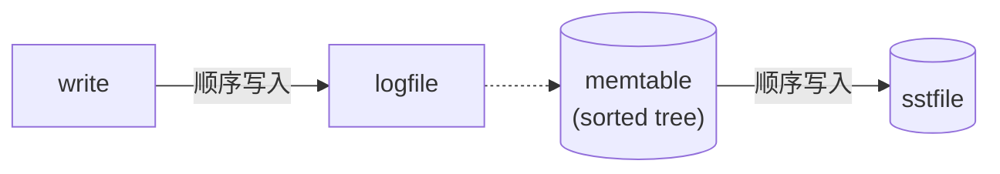

# 持久化 KV 存储

RocksDB 是一个 kv 型的存储引擎, Facebook 基于 Google 的 LevelDB 开发的

优点有三:

- 贼能存
- 对于中小型 kv, 在闪存或内存中有优化
- 能充分利用多核处理器

## RocksDB 的基本结构

memtable, sstfile, logfile

- memtable
  内存中的结构, sorted tree
- sstfile(Sorted String Table)
  一层一层的, 默认格式是 BlockBasedTable
- logfile
  sequentially-written 文件

写入会双写, 通过 Write Ahead Log(WAL) 机制写入 logfile(可选的), 然后写入 memtable;
memtable 写满时, 会刷到 sstfile, 并删除 logfile;
sstfile 的存放是一层层有序的, 便于查找;
随着不断地存储, kv 可能分裂到多个 sstfile 中, 这时后台会有合并压缩;
BlockBasedTable 里面分为不同的区块, 参见 <https://github.com/facebook/rocksdb/wiki/Rocksdb-BlockBasedTable-Format>;

## LSM 结构由来

Google BigTable 中提出了 LSM(Log Structured-Merge Tree) 的概念, LSM 的出现, 是为了尽可能地使用磁盘顺序写入, 牺牲一部分读性能;
磁盘顺序写入跟磁盘随机写入相比, 性能差了一个数量级

## LSM Tree

### 写

### sstfile 压缩

sstfile 是不会随机写的, 随着不断地写入, 相同的 key 有可能散落在不同的 sstfile 中, 这时会有压缩, 将多个 sstfile 压缩 merge 成一个.

### 读

读相对而言是比较难的, 如果在 memtable 中找不到该元素, 就需要在每个 sstfile 中寻找想要查找的数据, 每个 sstfile 中会有索引块和过滤器块等结构, 便于检索.
