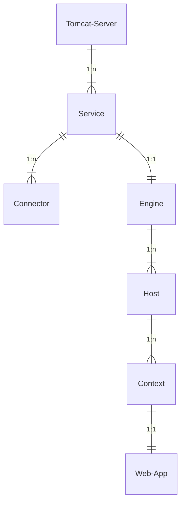
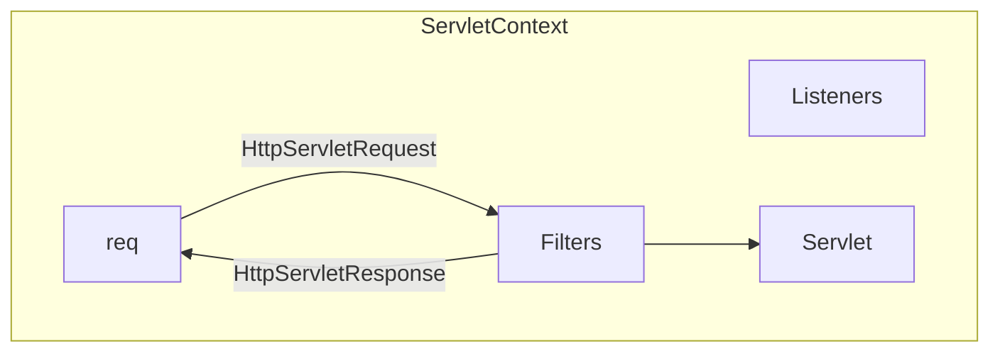
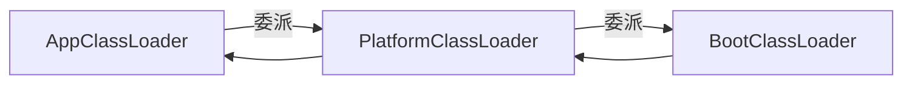

# Tomcat

Tomcat 是 Web Server

## Tomcat 架构



-   Connector: 连接器。例如 HTTP、HTTPS、AJP 等
-   Host: 主机。可以根据域名区分
-   Context: 上下文。可以根据路径区分

## Servlet 规范

Servlet 规范是 Java Servlet API 的规范，用于定义 Web Server 如何处理 HTTP 请求和响应。  
Servlet 规范是 Web Server 和 Web App 交互的桥梁。

> 除 Tomcat 外，还有 Jetty、GlassFish、Undertow 等多种 Web 服务器

### Servlet 处理流程



ServletContext、HttpServletRequest 和 HttpServletResponse 都是接口，具体实现由 Web Server 完成。  
Filter、Servlet、Listener 组件也是接口，但具体实现由 Web App 完成。

## 处理 HTTP Connector

到达 Engine 前，要有 Connector 处理网络连接，直接用`com.sun.net.httpserver.HttpHandler`。  
主要就 2 部分，1. 监听 TCP 端口，2. 接受 HTTP 请求，处理输入输出。

-   HttpHandler：处理 HTTP 请求的核心接口，必须实现 handle(HttpExchange)方法；
-   HttpServer：通过指定 IP 地址和端口号，定义一个 HTTP 服务实例；
-   HttpExchange：可以获取并操作 HTTP 请求的输入和输出。

## 实现 Servlet

### HttpExchange 变 HttpServletRequest

1. 用 Adapter 持有 HttpExchange，并实现 HttpServletRequest 和 HttpServletResponse 的相关方法。
2. 分别实现 HttpServletRequest 和 HttpServletResponse，并持有 Adapter。

### 应用程序的运行环境

ServletContext 代表应用程序的运行环境，是一个 Web App 的全局唯一实例。它本身就可以当容器，管理内部的 Servlet。  
启动的时候就将所有 Servlet 初始化。

### Filter

1. 责任链模式，实现一个 FilterChain，持有 Filter[] 和 最后的 Servlet, 并维护 idx
2. Filter 实现 `void doFilter(ServletRequest request, ServletResponse response, FilterChain chain)`方法，将 chain 传入，递归调用。

### Listener

观察者模式，Listener 注册在 Context 中， 事件定义成 Context 中的方法，事件触发时遍历 Listener 进行通知。

## 加载 Web App

`.war`文件

```
hello-webapp
── WEB-INF
│   ├── classes
│   │   └── com
│   │       └── example
│   │           ├── filter
│   │           │   └── LogFilter.class
│   │           ├── listener
│   │           │   ├── HelloHttpSessionListener.class
│   │           │   └── HelloServletContextAttributeListener.class
│   │           ├── servlet
│   │           │   ├── HelloServlet.class
│   │           │   └── IndexServlet.class
│   │           └── util
│   │               └── DateUtil.class
│   └── lib
│       ├── logback-classic-1.4.6.jar
│       ├── logback-core-1.4.6.jar
│       └── slf4j-api-2.0.4.jar
├── contact.html
└── favicon.ico
```

`/WEB-INF/classes` 放 `.class`文件  
`/WEB-INF/lib` 放 `.jar`包  
浏览器不能访问 `/WEB-INF/`目录

### 类加载

1. BootClassLoader
2. PlatformClassLoader
3. AppClassLoader

双亲委派加载过程



加载 `hello-webapp.war` 的时候，因为 `.class` 不在 classpath 里，所以 AppClassLoader 会加载失败，所以需要自定义类加载器。

类加载就是获取到 `.class` 文件的字节码，然后通过 `loadClass()` 加载到 JVM。用 URLClassLoader 比较方便。
