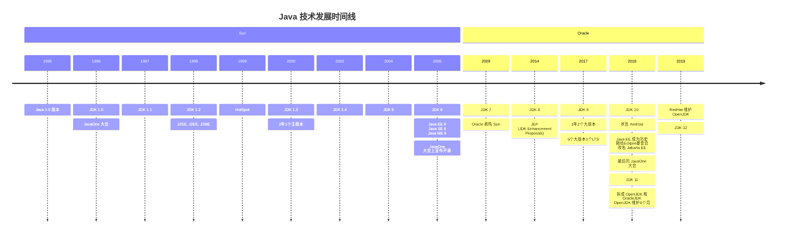

# java 发展史

```mermaid
timeline
    title Java 技术发展时间线
    section Sun
        1995 : Java 1.0 版本
        1996 : JDK 1.0
             : JavaOne 大会
        1997 : JDK 1.1
        1998 : JDK 1.2
             : J2SE, J2EE, J2ME
        1999 : HotSpot
        2000 : JDK 1.3
             : 2年1个主版本
        2002 : JDK 1.4
        2004 : JDK 5
        2006 : JDK 6
             : Java EE 6<br>Java SE 6<br>Java ME 6
             : JavaOne 大会上宣布开源
    section Oracle
        2009 : JDK 7
             : Oracle 收购 Sun
        2014 : JDK 8
             : JEP<br>(JDK Enhancement Proposals)
        2017 : JDK 9
             : 1年2个大版本
             : 6个大版本1个LTS
        2018 : JDK 10
             : 状告 Android
             : Java EE 成为历史<br>捐给Eclipse基金会<br>改名 Jakarta EE
             : 最后的 JavaOne 大会
             : JDK 11
             : 拆成 OpenJDK 和 OracleJDK<br>OpenJDK 维护6个月
        2019 : RedHat 维护 OpenJDK
             : JDK 12
```
