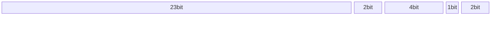
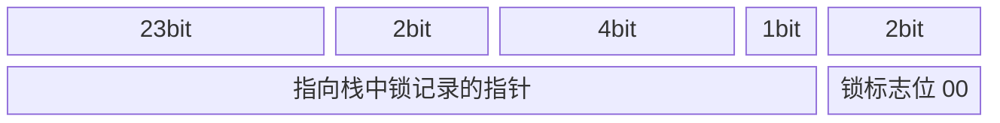
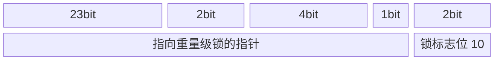
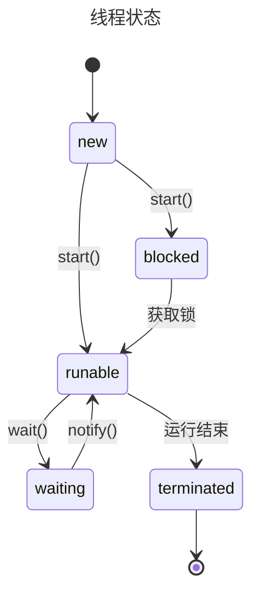

# 并发

闲言少叙, 并发的目的在于充分利用计算资源(CPU), 其难点在于如何处理共享资源

## JVM 线程模型

JVM 是运行在 OS 上的, JVM 的线程与操作系统的线程之间存在某种映射关系, 这种规范和协议就是 JVM 线程模型

### Linux 内核的线程概念

Linux 线程是个抽象概念, 是通过轻量级进程实现的  
进程与轻量级进程的差异: 1 个进程拥有自己独立的地址空间, 而轻量级进程没有, 只能共享同 1 个轻量级进程组下的地址空间

### 主流的线程模型

-   1 用户线程对 1 操作系统线程  
    优点: 线程之间独立  
    缺点: 用户线程调度会直接影响内核线程, 降低性能

    > JVM 属于此类

-   多用户线程对 1 操作系统线程  
    优点: 线程调度可以在用户空间完成, 减少状态切换  
    缺点: 1 个用户线程阻塞, 影响其他线程

    > JVM 早期采用

-   多用户线程对多操作系统线程  
    优点: 综合上述 2 者优点  
    缺点: 实现复杂

    > Golang 的 GMP 线程模型

## 共享资源访问之:悲观锁

java 的设计是将锁放在对象头中, 也就是将对象视为共享资源

### 对象头中的锁标志

顺带提一下, 对象在内存中的结构:

-   对象头
    -   mark word
    -   类型指针
-   实例数据
-   对齐填充

Mark Word: 32bit

### 锁升级

无锁状态

---

偏向锁状态

偏向: 1 个线程加锁后, 如果没有其他线程竞争, 该线程可以直接获取锁  
持有偏向锁的线程不会主动释放锁  
当线程尝试获取偏向锁时, 如果已经偏向过, 会判断偏向锁是否有效, 如果无效, 偏向锁会回退, 然后线程 cas 抢锁; 偏向锁有效则会锁升级

---

轻量级锁状态

-   1 个线程发现该对象是轻量级锁后, 会在自己的虚拟机栈中开辟一块空间 "Lock Record", 存放 markword 副本和 owner 指针, owner 指针指向该对象锁.
-   markword 的前 32 位存放指针, 指向 Lock Record.

这样锁和线程就互相感知了  
如果有其他线程想要获取轻量级锁, 会在用户态自旋等待. 自旋有适应性自旋, 如果该线程在同一个锁上刚刚成功获得过锁, 虚拟机允许更长的自旋时间  
如果有超过 2 个线程竞争, 会升级为重量级锁

---

重量级锁状态

-   重量级锁依赖于操作系统的 Mutex Lock, 使用 monitorenter 和 monitorexit 指令控制线程进出 Monitor 区域, 也是 synchronized 最早的底层实现

---

原始比例:

