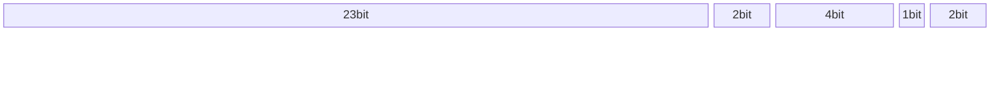
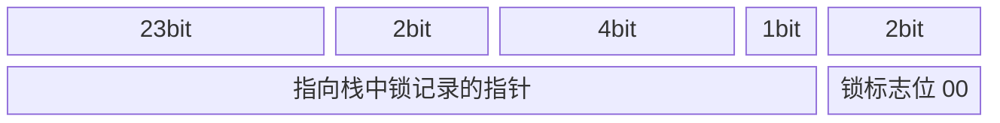
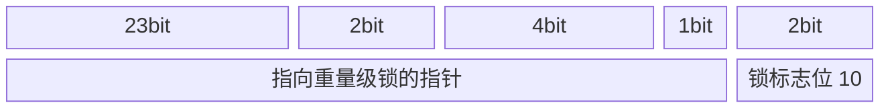
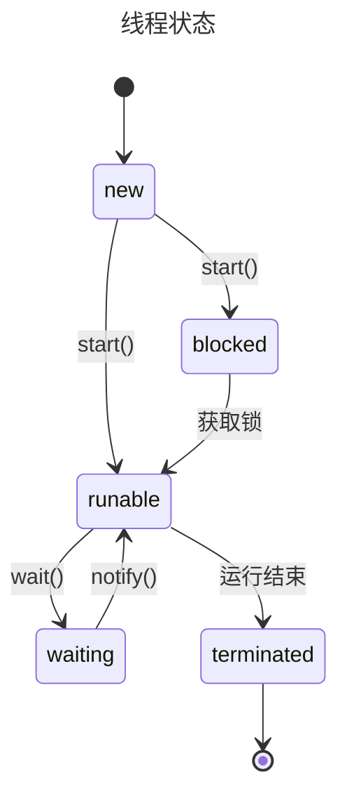

# 并发

闲言少叙, 并发的目的在于充分利用计算资源(CPU), 其难点在于如何处理共享资源

## JVM 线程模型

JVM 是运行在 OS 上的, JVM 的线程与操作系统的线程之间存在某种映射关系, 这种规范和协议就是 JVM 线程模型

### Linux 内核的线程概念

Linux 线程是个抽象概念, 是通过轻量级进程实现的  
进程与轻量级进程的差异: 1 个进程拥有自己独立的地址空间, 而轻量级进程没有, 只能共享同 1 个轻量级进程组下的地址空间

### 主流的线程模型

-   1 用户线程对 1 操作系统线程  
    优点: 线程之间独立  
    缺点: 用户线程调度会直接影响内核线程, 降低性能

    > JVM 属于此类

-   多用户线程对 1 操作系统线程  
    优点: 线程调度可以在用户空间完成, 减少状态切换  
    缺点: 1 个用户线程阻塞, 影响其他线程

    > JVM 早期采用

-   多用户线程对多操作系统线程  
    优点: 综合上述 2 者优点  
    缺点: 实现复杂

    > Golang 的 GMP 线程模型

## 悲观锁

java 的设计是将锁放在对象头中, 也就是将对象视为共享资源

### synchronized

synchronized 会编译成 2 个字节码指令 monitorenter 和 monitorexit, 用它们控制线程进出锁定区域.  
底层依赖于操作系统的 Mutex Lock

### 对象头中的锁标志

顺带提一下, 对象在内存中的结构:

-   对象头
    -   mark word
    -   类型指针
-   实例数据
-   对齐填充

Mark Word: 32bit



### 锁升级

源码: <https://github.com/openjdk/jdk8u/blob/master/hotspot/src/share/vm/runtime/synchronizer.cpp>

#### 无锁状态(不可偏向状态)


---

#### 偏向锁状态

偏向锁已经在 JDK15 弃用 <https://openjdk.org/jeps/374>, 因为偏向锁在出现竞争时有昂贵的撤销操作


如果对象是可偏向模式, 偏向锁标志位是 1, 如果标志位是 0, 则该对象不可偏向  
偏向: 1 个线程加锁后, 如果没有其他线程竞争, 该线程可以直接获取锁, 无需任何同步操作

当出现线程竞争偏向锁时, 偏向锁会撤销(撤销后不能再偏向); 然后判断偏向锁是否有效

-   如果锁无效, 变成无锁状态
-   如果锁有效, 则会升级为轻量级锁

---

#### 轻量级锁状态



-   1 个线程发现该对象的锁状态标志为轻量级锁, 会在自己的栈中开辟一块空间 "Lock Record", 存放 markword 副本和 owner 指针, owner 指针指向该对象锁.
-   markword 的前 32 位存放指针, 指向 Lock Record.

在线程栈中存储主要是为了将 mark word 恢复

抢锁和释放锁都有 CAS 操作:

-   如果有其他线程想要获取轻量级锁, 会在用户态 CAS 自旋等待, CAS 失败则锁膨胀为重量级锁.

    > 自旋有适应性自旋, 如果该线程在同一个锁上刚刚成功获得过锁, 虚拟机允许更长的自旋时间

-   如果释放锁 CAS 失败了, 说明现在已经是重量级锁, 也意味着有其他线程尝试获取过锁, 那么除了要释放锁, 还要唤醒其他线程

设计的初衷是当没有锁竞争的情况下, 减少使用操作系统互斥量的开销. 如果有 2 个及以上线程竞争, 会升级为重量级锁

---

#### 重量级锁状态



重量级锁指的是 mark word 中指向的 ObjectMonitor 对象, 其中包括(但不只有) entry set 和 wait set 区域.



## 乐观锁

悲观锁在操作系统的用户态和内核态之间切换, 其开销是很大的, 乐观锁或许是另一种选择

### CAS 的原子性

想要使用 CAS 当作锁(某一时刻只有 1 个线程对共享资源修改), 必须保证 CAS 是原子操作.  
不同架构的 CPU 都提供了指令级的 cas 原子操作, 如 x86 架构下的 cmpxchg 指令, ARM 架构下的 LL/SC 指令.

在虚拟机中, 对 native 方法`compareAndSwapInt()`的实现: <https://github.com/openjdk/jdk8u/blob/master/hotspot/src/share/vm/runtime/atomic.cpp>

```cpp
jbyte Atomic::cmpxchg(jbyte exchange_value, volatile jbyte* dest, jbyte compare_value) {
  assert(sizeof(jbyte) == 1, "assumption.");
  uintptr_t dest_addr = (uintptr_t)dest;
  uintptr_t offset = dest_addr % sizeof(jint);
  volatile jint* dest_int = (volatile jint*)(dest_addr - offset);
  jint cur = *dest_int;
  jbyte* cur_as_bytes = (jbyte*)(&cur);
  jint new_val = cur;
  jbyte* new_val_as_bytes = (jbyte*)(&new_val);
  new_val_as_bytes[offset] = exchange_value;
  while (cur_as_bytes[offset] == compare_value) {
    jint res = cmpxchg(new_val, dest_int, cur);
    if (res == cur) break;
    cur = res;
    new_val = cur;
    new_val_as_bytes[offset] = exchange_value;
  }
  return cur_as_bytes[offset];
}
```

在更上层, `Unsafe` 类对底层实现做了封装, 并暴露了 native 方法

## 并发的应用层封装

JUC, `java.util.concurrent` 包是 Java 语言提供的官方并发 sdk, 其中的 原子类、并发队列、同步工具、并发集合、并发锁、线程池等都是非常常用的. 接下来分别介绍它们.

### Atomic 原子类

原子类有 5 类: 基本类型, Array, Reference, Updater, Striped64(条纹)

利用 CAS, volatile 和 native 方法来保证原子操作  
拿期望的值和原本的一个值作比较, 如果相同则更新成新的值

UnSafe 类的 objectFieldOffset() 方法是一个 native 方法, 这个方法用来拿到"原来的值"的内存地址, 返回值是 valueOffset.  
另外 value 是一个 volatile 变量, 在内存中可见, 因此 JVM 可以保证总能拿到该变量的最新值

#### 基本类型

使用原子的方式更新基本类型

-   AtomicInteger：整形原子类
-   AtomicLong：长整型原子类
-   AtomicBoolean：布尔型原子类

#### 数组类型

使用原子的方式更新数组里的某个元素

-   AtomicIntegerArray：整形数组原子类
-   AtomicLongArray：长整形数组原子类
-   AtomicReferenceArray：引用类型数组原子类

#### 引用类型

-   AtomicReference：引用类型原子类
-   AtomicStampedReference：原子更新带有版本号的引用类型

    > 可以解决使用 CAS 进行原子更新时可能出现的 ABA 问题

-   AtomicMarkableReference ：原子更新带有标记位的引用类型
    > 标记位能标识是否修改过

#### 对象的属性修改器

更新对象的属性必须 volatile 修饰

-   AtomicIntegerFieldUpdater：原子更新整形字段的更新器
-   AtomicLongFieldUpdater：原子更新长整形字段的更新器
-   AtomicReferenceFieldUpdater：原子更新引用类型字段的更新器

#### 分段计数器

-   Striped64  
    abstract class, 其名字的含义是"条纹", 通过 base+分段的设计细分锁粒度, 提高并发度

-   LongAdder
-   DoubleAdder
-   LongAccumulator: LongAdder 的增强版
    > 提供了自定义二元操作的能力, LongAdder 等效于相加操作 new LongAccumulator((x, y) -> x + y, 0L).
-   DoubleAccumulator

---

### 并发基石 AQS

#### 设计理念

要设计一个基于 CAS 原语的并发框架, 封装对共享资源的访问, 并提供通用的扩展能力, 要怎么设计?  
首先要明确要解决哪些问题:

1. 如何标识访问共享资源的状态? 怎样处理共享和独占?
2. 如果出现竞争, 要怎么处理?

一个一个说, 要标识访问共享资源的状态, 用一个 status 字段就能搞定, 访问共享资源前, 先读 status;

```java
private volatile int state;
```

如果出现竞争呢? 让所有线程都 CAS 吗? 这样很浪费资源. 那可以用一个阻塞队列, 存放竞争资源的线程;  
如果竞争资源失败, 怎么处理? 可以自旋重试, 也可以放弃, 在这方面可以提供多种策略.

### 并发队列

### 同步工具

### 并发锁

### 并发集合

### 线程池

---

原始比例:


