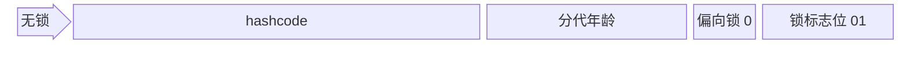
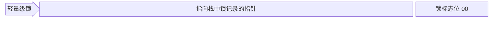
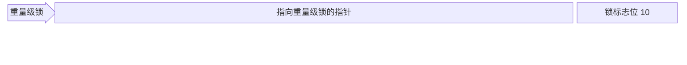
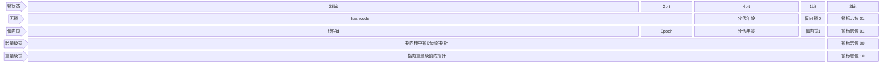

# 并发

闲言少叙, 并发的目的在于充分利用计算资源(CPU), 其难点在于如何处理共享资源

## JVM 线程模型

JVM 是运行在 OS 上的, JVM 的线程与操作系统的线程之间存在某种映射关系, 这种规范和协议就是 JVM 线程模型

### Linux 内核的线程概念

Linux 线程是个抽象概念, 是通过轻量级进程实现的  
进程与轻量级进程的差异: 1 个进程拥有自己独立的地址空间, 而轻量级进程没有, 只能共享同 1 个轻量级进程组下的地址空间

### 主流的线程模型

-   1 用户线程对 1 操作系统线程  
    优点: 线程之间独立  
    缺点: 用户线程调度会直接影响内核线程, 降低性能

    > JVM 属于此类

-   多用户线程对 1 操作系统线程  
    优点: 线程调度可以在用户空间完成, 减少状态切换  
    缺点: 1 个用户线程阻塞, 影响其他线程

    > JVM 早期采用

-   多用户线程对多操作系统线程  
    优点: 综合上述 2 者优点  
    缺点: 实现复杂

    > Golang 的 GMP 线程模型

## 共享资源访问之:悲观锁

java 的设计是将锁放在对象头中, 也就是将对象视为共享资源

### 对象头中的锁标志

Mark Word: 32bit

### 锁升级

---

原始比例:

