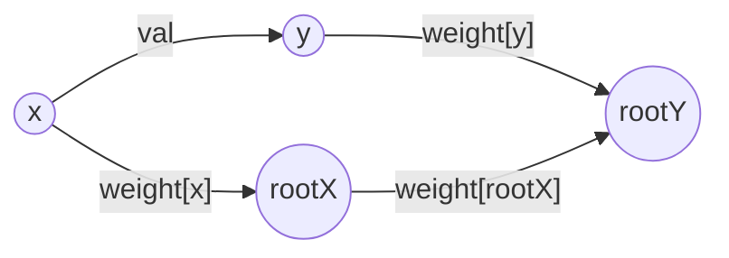

# 搜索

## 搜索可达

### 79. 单词搜索 mid

> 剑指 Offer 12. 矩阵中的路径

给定一个 m x n 二维字符网格 board 和一个字符串单词 word 。如果 word 存在于网格中, 返回 true；否则, 返回 false 。

单词必须按照字母顺序, 通过相邻的单元格内的字母构成, 其中“相邻”单元格是那些水平相邻或垂直相邻的单元格。同一个单元格内的字母不允许被重复使用。

**解法 DFS**

> 每个位置都作为 start 搜索, 四个方向遍历 递归

```java
class Solution {
    private final int[][] direction = {{1, 0}, {-1, 0}, {0, 1}, {0, -1}};
    private int rc;
    private int cc;
    boolean[][] visit;
    char[][] board;
    String word;

    public boolean exist(char[][] board, String word) {
        this.board = board;
        this.word = word;
        rc = board.length;
        cc = board[0].length;
        visit = new boolean[rc][cc];

        for (int r = 0; r < rc; r++) {
            for (int c = 0; c < cc; c++) {
                if (backtracking(0, r, c)) return true;
            }
        }
        return false;
    }

    private boolean backtracking(int idx, int r, int c) {
        if (idx == word.length()) return true;

        if (r < 0 || r >= rc || c < 0 || c >= cc
                || board[r][c] != word.charAt(idx)
                || visit[r][c]) {
            return false;
        }

        visit[r][c] = true;

        for (int[] d : direction) {
            if (backtracking(idx + 1, r + d[0], c + d[1])) return true;
        }
        visit[r][c] = false;

        return false;
    }
}
```

### 130. 被围绕的区域 mid

给你一个 m x n 的矩阵 board, 由若干字符 'X' 和 'O', 找到所有被 'X' 围绕的区域, 并将这些区域里所有的 'O' 用 'X' 填充。

> 只从最外层进行 DFS, 标记哪些不能更改, 剩下的遍历全改掉

```java
class Solution {
    private int[][] dir = {{0, 1}, {0, -1}, {1, 0}, {-1, 0}};
    private int rc, cc;

    public void solve(char[][] board) {
        if (board == null || board.length == 0) return;
        rc = board.length;
        cc = board[0].length;

        // 竖边
        for (int r = 0; r < rc; r++) {
            dfs(board, r, 0);
            dfs(board, r, cc - 1);
        }
        // 横边
        for (int c = 0; c < cc; c++) {
            dfs(board, 0, c);
            dfs(board, rc - 1, c);
        }

        for (int i = 0; i < rc; i++) {
            for (int j = 0; j < cc; j++) {
                if (board[i][j] == 'T') board[i][j] = 'O';
                else if (board[i][j] == 'O') board[i][j] = 'X';
            }
        }
    }

    private void dfs(char[][] board, int r, int c) {
        if (r < 0 || r >= rc || c < 0 || c >= cc
                || board[r][c] != 'O') return;
        // all O==>T
        board[r][c] = 'T';
        for (int[] d : dir) {
            dfs(board, r + d[0], c + d[1]);
        }
    }
}
```

### 200. 岛屿数量 mid

给你一个由 '1'（陆地）和 '0'（水）组成的的二维网格, 请你计算网格中岛屿的数量。

岛屿总是被水包围, 并且每座岛屿只能由水平方向和/或竖直方向上相邻的陆地连接形成。

此外, 你可以假设该网格的四条边均被水包围。

```java
class Solution {
    private int rc, cc;
    private int[][] dir = {{0, 1}, {0, -1}, {1, 0}, {-1, 0}};

    public int numIslands(char[][] grid) {
        rc = grid.length;
        cc = grid[0].length;

        int cnt = 0;
        for (int i = 0; i < rc; i++) {
            for (int j = 0; j < cc; j++) {
                if (grid[i][j] == '1') {
                    cnt++;
                    dfs(grid, i, j);
                }
            }
        }
        return cnt;

    }

    private void dfs(char[][] grid, int r, int c) {
        if (r < 0 || r >= rc || c < 0 || c >= cc
                || grid[r][c] == '0') return;

        grid[r][c] = '0';

        for (int[] d : dir) {
            dfs(grid, r + d[0], c + d[1]);
        }
    }
}
```

### 399. 除法求值 mid

给你一个变量对数组 $equations$ 和一个实数值数组 $values$ 作为已知条件, 其中 $equations[i] = [A_i, B_i]$ 和 $values[i]$ 共同表示等式 $A_i / B_i = values[i]$ 。每个 $A_i$ 或 $B_i$ 是一个表示单个变量的字符串。

另有一些以数组 $queries$ 表示的问题, 其中 $queries[j] = [C_j, D_j]$ 表示第 $j$ 个问题, 请你根据已知条件找出 $C_j / D_j = ?$ 的结果作为答案。

返回 所有问题的答案 。如果存在某个无法确定的答案, 则用 -1.0 替代这个答案。如果问题中出现了给定的已知条件中没有出现的字符串, 也需要用 -1.0 替代这个答案。

注意：输入总是有效的。你可以假设除法运算中不会出现除数为 0 的情况, 且不存在任何矛盾的结果。

注意：未在等式列表中出现的变量是未定义的, 因此无法确定它们的答案。

> a/b = val, 相当于 a-->b 有条权为 val 的边

**解法 1 建图 DFS**

```java
class Solution {
    static class Edge {
        String n;
        double w;

        public Edge(String n, double w) {
            this.n = n;
            this.w = w;
        }
    }

    public double[] calcEquation(List<List<String>> equations, double[] values, List<List<String>> queries) {
        Map<String, List<Edge>> edges = new HashMap<>();
        for (int i = 0; i < equations.size(); i++) {
            List<String> equation = equations.get(i);
            edges.computeIfAbsent(equation.get(0), o -> new ArrayList<>()).add(new Edge(equation.get(1), values[i]));
            edges.computeIfAbsent(equation.get(1), o -> new ArrayList<>()).add(new Edge(equation.get(0), 1.0 / values[i]));
        }
        double[] res = new double[queries.size()];
        for (int i = 0; i < queries.size(); i++) {
            List<String> query = queries.get(i);
            res[i] = dfs(edges, query.get(0), query.get(1), new HashSet<>());
        }
        return res;
    }

    // 返回 a,b 的距离
    double dfs(final Map<String, List<Edge>> edges, String start, String target, Set<String> visit) {
        if (!edges.containsKey(target)) return -1;
        if (start.equals(target)) return 1;
        visit.add(start);
        List<Edge> edgeList = edges.get(start);
        if (edgeList == null) return -1;
        for (Edge e : edgeList) {
            if (visit.contains(e.n)) continue;
            double dis = dfs(edges, e.n, target, visit);
            if (dis != -1) return e.w * dis;
        }
        return -1;
    }
}
```

**解法 2 带权并查集**

> union 的时候有方向, 要将 x 并到 y

```java
class Solution {

    public double[] calcEquation(List<List<String>> equations, double[] values, List<List<String>> queries) {
        int n = equations.size();
        UnionFind unionFind = new UnionFind(2 * n);
        Map<String, Integer> map = new HashMap<>();
        int id = 0;
        for (int i = 0; i < n; i++) {
            List<String> equation = equations.get(i);
            String a = equation.get(0);
            String b = equation.get(1);
            if (null == map.putIfAbsent(a, id)) id++;
            if (null == map.putIfAbsent(b, id)) id++;
            unionFind.union(map.get(a), map.get(b), values[i]);
        }
        n = queries.size();
        double[] res = new double[n];
        for (int i = 0; i < n; i++) {
            List<String> query = queries.get(i);
            String a = query.get(0);
            String b = query.get(1);
            Integer id1 = map.get(a);
            Integer id2 = map.get(b);
            if (id1 == null || id2 == null) {
                res[i] = -1.0;
                continue;
            }
            res[i] = unionFind.isConnected(id1, id2);
        }
        return res;
    }

    private static class UnionFind {

        private final int[] parent;

        private final double[] weight;

        public UnionFind(int n) {
            this.parent = new int[n];
            this.weight = new double[n];
            for (int i = 0; i < n; i++) {
                parent[i] = i;
                weight[i] = 1.0;
            }
        }

        public void union(int x, int y, double value) {
            int rootX = find(x);
            int rootY = find(y);
            if (rootX == rootY) return;
            parent[rootX] = rootY;
            // 看图
            weight[rootX] = value * weight[y] / weight[x];
        }

        public int find(int x) {
            if (x != parent[x]) {
                int originWeight = parent[x];
                parent[x] = find(parent[x]);
                weight[x] *= weight[originWeight];
            }
            return parent[x];
        }

        public double isConnected(int x, int y) {
            int rootX = find(x);
            int rootY = find(y);
            return rootX == rootY ? weight[x] / weight[y] : -1.0;
        }
    }
}
```

union 过程:



### 417. 太平洋大西洋水流问题 mid

有一个 m × n 的矩形岛屿, 与 太平洋 和 大西洋 相邻。 “太平洋” 处于大陆的左边界和上边界, 而 “大西洋” 处于大陆的右边界和下边界。

这个岛被分割成一个由若干方形单元格组成的网格。给定一个 m x n 的整数矩阵 heights, heights[r][c] 表示坐标 (r, c) 上单元格 高于海平面的高度。

岛上雨水较多, 如果相邻单元格的高度 小于或等于 当前单元格的高度, 雨水可以直接向北、南、东、西流向相邻单元格。水可以从海洋附近的任何单元格流入海洋。

返回网格坐标 result 的 2D 列表, 其中 result[i] = [ri, ci] 表示雨水从单元格 (ri, ci) 流动 既可流向太平洋也可流向大西洋

**解法 DFS**

> 从 4 边往里进行 DFS, 用 2 个矩阵标记, 其中重合的就是

```java
class Solution {
    private int rc, cc;
    private int[][] matrix;
    private int[][] direction = {{0, 1}, {0, -1}, {1, 0}, {-1, 0}};

    public List<List<Integer>> pacificAtlantic(int[][] matrix) {
        List<List<Integer>> res = new ArrayList<>();

        rc = matrix.length;
        cc = matrix[0].length;
        this.matrix = matrix;
        boolean[][] canReachP = new boolean[rc][cc];// Pacific Ocean
        boolean[][] canReachA = new boolean[rc][cc];// Atlantic Ocean

        for (int i = 0; i < rc; i++) {
            dfs(i, 0, canReachP);
            dfs(i, cc - 1, canReachA);
        }
        for (int i = 0; i < cc; i++) {
            dfs(0, i, canReachP);
            dfs(rc - 1, i, canReachA);
        }

        for (int i = 0; i < rc; i++) {
            for (int j = 0; j < cc; j++) {
                if (canReachP[i][j] && canReachA[i][j]) {
                    res.add(Arrays.asList(i, j));
                }
            }
        }
        return res;
    }

    private void dfs(int r, int c, boolean[][] canReach) {
        if (canReach[r][c]) return;
        canReach[r][c] = true;
        for (int[] d : direction) {
            int nextR = d[0] + r;
            int nextC = d[1] + c;
            if (nextR < 0 || nextR >= rc || nextC < 0 || nextC >= cc
                    || matrix[r][c] > matrix[nextR][nextC]) continue;
            dfs(nextR, nextC, canReach);
        }
    }
}
```

### 547. 省份数量 mid

有 n 个城市，其中一些彼此相连，另一些没有相连。如果城市 a 与城市 b 直接相连，且城市 b 与城市 c 直接相连，那么城市 a 与城市 c 间接相连。
省份 是一组直接或间接相连的城市，组内不含其他没有相连的城市。

给你一个 n x n 的矩阵 isConnected ，其中 isConnected[i][j] = 1 表示第 i 个城市和第 j 个城市直接相连，而 isConnected[i][j] = 0 表示二者不直接相连。
返回矩阵中 省份 的数量。

**解法 1 DFS**

```java
class Solution {

    public int findCircleNum(int[][] isConnected) {
        int n = isConnected.length;
        int res = 0;
        boolean[] visit = new boolean[n];
        for (int i = 0; i < n; i++) {
            if (!visit[i]) {
                dfs(isConnected, i, visit);
                res++;
            }
        }
        return res;
    }

    private void dfs(int[][] isConnected, int i, boolean[] visit) {
        visit[i] = true;
        for (int j = 0; j < isConnected.length; j++) {
            if (isConnected[i][j] == 1 && !visit[j]) dfs(isConnected, j, visit);
        }
    }
}
```

**解法 2 并查集**

```java
class Solution {
    public int findCircleNum(int[][] isConnected) {
        int n = isConnected.length;
        UnionFind uf = new UnionFind(n);
        for (int i = 0; i < n; i++) {
            for (int j = i + 1; j < n; j++) {
                if (isConnected[i][j] == 1) uf.union(i, j);
            }
        }
        int res = 0;
        for (int i = 0; i < n; i++) {
            if (uf.find(i) == i) res++;
        }
        return res;
    }

    static class UnionFind {
        int[] parent;

        public UnionFind(int n) {
            this.parent = new int[n];
            for (int i = 0; i < n; i++) {
                parent[i] = i;
            }
        }

        public void union(int i, int j) {
            parent[find(i)] = find(j);
        }

        public int find(int i) {
            if (parent[i] != i) {
                parent[i] = find(parent[i]);
            }
            return parent[i];
        }
    }
}
```

### 695. 岛屿的最大面积 mid

给你一个大小为 m x n 的二进制矩阵 grid 。  
岛屿 是由一些相邻的 1 (代表土地) 构成的组合，这里的「相邻」要求两个 1 必须在 水平或者竖直的四个方向上 相邻。你可以假设 grid 的四个边缘都被 0（代表水）包围着。  
岛屿的面积是岛上值为 1 的单元格的数目。  
计算并返回 grid 中最大的岛屿面积。如果没有岛屿，则返回面积为 0。

**解法 DFS**

> 走过的直接标记为水

```java
class Solution {
    int r, c;
    int[][] dir = {{0, 1}, {0, -1}, {1, 0}, {-1, 0}};

    public int maxAreaOfIsland(int[][] grid) {
        if (grid == null || grid.length == 0) return 0;
        r = grid.length;
        c = grid[0].length;
        int res = 0;
        for (int i = 0; i < r; i++) {
            for (int j = 0; j < c; j++) {
                if (grid[i][j] == 0) continue;
                res = Math.max(res, dfs(grid, i, j));
            }
        }
        return res;
    }

    int dfs(int[][] grid, int i, int j) {
        if (i < 0 || i >= r || j < 0 || j >= c || grid[i][j] == 0) return 0;
        // 标记走过的位置
        grid[i][j] = 0;
        int area = 1;
        for (int[] d : dir) {
            area += dfs(grid, i + d[0], j + d[1]);
        }
        return area;
    }
}
```

### 733. 图像渲染 easy

有一幅以 m x n 的二维整数数组表示的图画 image ，其中 image[i][j]表示该图画的像素值大小。

你也被给予三个整数 sr , sc 和 newColor 。你应该从像素 image[sr][sc]开始对图像进行 上色填充 。

为了完成 上色工作 ，从初始像素开始，记录初始坐标的 上下左右四个方向上 像素值与初始坐标相同的相连像素点，接着再记录这四个方向上符合条件的像素点与他们对应 四个方向上 像素值与初始坐标相同的相连像素点，……，重复该过程。将所有有记录的像素点的颜色值改为 newColor 。

最后返回 经过上色渲染后的图像。

**解法 1 BFS**

```java
class Solution {
    public int[][] floodFill(int[][] image, int sr, int sc, int color) {
        int[][] dic = {{1, 0}, {-1, 0}, {0, 1}, {0, -1}};
        int r = image.length, c = image[0].length;
        boolean[][] visit = new boolean[r][c];
        Queue<int[]> que = new ArrayDeque<>();
        que.add(new int[]{sr, sc});
        while (!que.isEmpty()) {
            int[] arr = que.remove();
            int x = arr[0], y = arr[1];
            visit[x][y] = true;
            for (int[] d : dic) {
                if (x + d[0] < 0 || x + d[0] >= r) continue;
                if (y + d[1] < 0 || y + d[1] >= c) continue;
                if (!visit[x + d[0]][y + d[1]] && image[x][y] == image[x + d[0]][y + d[1]])
                    que.add(new int[]{x + d[0], y + d[1]});
            }
            image[x][y] = color;
        }
        return image;
    }
}
```

**解法 2 DFS**

```java
class Solution {
    int[] dx = {1, 0, 0, -1};
    int[] dy = {0, 1, -1, 0};

    public int[][] floodFill(int[][] image, int sr, int sc, int color) {
        int currColor = image[sr][sc];
        if (currColor != color) {
            dfs(image, sr, sc, currColor, color);
        }
        return image;
    }

    public void dfs(int[][] image, int x, int y, int currColor, int color) {
        if (image[x][y] == currColor) {
            image[x][y] = color;
            for (int i = 0; i < 4; i++) {
                int mx = x + dx[i], my = y + dy[i];
                if (mx >= 0 && mx < image.length && my >= 0 && my < image[0].length) {
                    dfs(image, mx, my, currColor, color);
                }
            }
        }
    }
}
```

## 最短路

### 127. 单词接龙 hard

字典 wordList 中从单词 beginWord 和 endWord 的 转换序列 是一个按下述规格形成的序列 beginWord -> s1 -> s2 -> ... -> sk：

-   每一对相邻的单词只差一个字母。
-   对于 1 <= i <= k 时, 每个 si 都在 wordList 中。注意, beginWord 不需要在 wordList 中。
-   sk == endWord

给你两个单词 beginWord 和 endWord 和一个字典 wordList, 返回 从 beginWord 到 endWord 的 最短转换序列 中的 单词数目 。如果不存在这样的转换序列, 返回 0

**解法 1 BFS**

> 返回是 整个龙中字符串的个数  
> 根据题目数据范围, 修改当前字符串的每个字符比遍历 wordlist 判断要快  
> 可以双向 BFS 进一步加速

```Java
class Solution {
    public int ladderLength(String beginWord, String endWord, List<String> wordList) {
        Set<String> wordSet = new HashSet<>(wordList);
        if (!wordSet.contains(endWord)) return 0;
        Set<String> visited = new HashSet<>();
        Queue<String> que = new LinkedList<>();
        que.add(beginWord);
        visited.add(beginWord);
        int cnt = 1;
        while (!que.isEmpty()) {
            int size = que.size();
            ++cnt;
            while (size-- > 0) {
                String start = que.remove();
                char[] startArr = start.toCharArray();
                for (int i = 0; i < startArr.length; i++) {
                    char c = startArr[i];
                    for (char j = 'a'; j <= 'z'; j++) {
                        if (c == j) continue;
                        startArr[i] = j;
                        String s = String.valueOf(startArr);
                        if (wordSet.contains(s) && !visited.contains(s)) {
                            if (s.equals(endWord)) return cnt;
                            visited.add(s);
                            que.add(s);
                        }
                    }
                    startArr[i] = c;
                }
            }
        }
        return 0;
    }
}
```

**解法 2 双向 BFS**

```java
class Solution {
    public int ladderLength(String beginWord, String endWord, List<String> wordList) {
        Set<String> wordSet = new HashSet<>(wordList);
        if (!wordSet.contains(endWord)) return 0;

        Set<String> visit1 = new HashSet<>();
        Queue<String> que1 = new LinkedList<>();
        que1.add(beginWord);
        visit1.add(beginWord);

        Queue<String> que2 = new LinkedList<>();
        Set<String> visit2 = new HashSet<>();
        que2.add(endWord);
        visit2.add(endWord);

        int cnt = 2;
        while (!que1.isEmpty() && !que2.isEmpty()) {
            int size1 = que1.size();
            while (size1-- > 0) {
                String start = que1.remove();
                char[] startArr = start.toCharArray();
                for (int i = 0; i < startArr.length; i++) {
                    char c = startArr[i];
                    for (char j = 'a'; j <= 'z'; j++) {
                        if (c == j) continue;
                        startArr[i] = j;
                        String s = String.valueOf(startArr);
                        if (wordSet.contains(s) && !visit1.contains(s)) {
                            if (visit2.contains(s)) return cnt;
                            visit1.add(s);
                            que1.add(s);
                        }
                    }
                    startArr[i] = c;
                }
            }
            cnt++;// que 里面多了一层

            int size2 = que2.size();
            while (size2-- > 0) {
                String start = que2.remove();
                char[] startArr = start.toCharArray();
                for (int i = 0; i < startArr.length; i++) {
                    char c = startArr[i];
                    for (char j = 'a'; j <= 'z'; j++) {
                        if (c == j) continue;
                        startArr[i] = j;
                        String s = String.valueOf(startArr);
                        if (wordSet.contains(s) && !visit2.contains(s)) {
                            if (visit1.contains(s)) return cnt;
                            visit2.add(s);
                            que2.add(s);
                        }
                    }
                    startArr[i] = c;
                }
            }
            cnt++;// que 里面多了一层
        }
        return 0;
    }
}
```

### 542. 01 矩阵 mid

> 剑指 Offer II 107. 矩阵中的距离

给定一个由 0 和 1 组成的矩阵 mat，请输出一个大小相同的矩阵，其中每一个格子是 mat 中对应位置元素到最近的 0 的距离。

两个相邻元素间的距离为 1。

**解法 1 BFS**

> 从 0 开始 BFS

```java
class Solution {
    public int[][] updateMatrix(int[][] mat) {
        int[][] dic = {{0, 1}, {0, -1}, {1, 0}, {-1, 0}};
        int r = mat.length, c = mat[0].length;
        Queue<int[]> que = new LinkedList<>();
        boolean[][] visit = new boolean[r][c];
        for (int i = 0; i < r; i++) {
            for (int j = 0; j < c; j++) {
                if (mat[i][j] == 0) {
                    que.add(new int[]{i, j});
                    visit[i][j] = true;
                }
            }
        }
        int[][] res = new int[r][c];
        int distance = 0;
        while (!que.isEmpty()) {
            int size = que.size();
            distance++;
            while (size-- > 0) {
                int[] point = que.remove();
                int i = point[0], j = point[1];
                for (int[] d : dic) {
                    int x = i + d[0], y = j + d[1];
                    if (x >= 0 && x < r && y >= 0 && y < c && !visit[x][y]) {
                        que.add(new int[]{x, y});
                        res[x][y] = distance;
                        visit[x][y] = true;
                    }
                }
            }
        }
        return res;
    }
}
```

**解法 2 DP**

略

### 752. 打开转盘锁 mid

> 剑指 Offer II 109. 开密码锁

你有一个带有四个圆形拨轮的转盘锁。每个拨轮都有 10 个数字： '0', '1', '2', '3', '4', '5', '6', '7', '8', '9' 。每个拨轮可以自由旋转：例如把 '9' 变为 '0'，'0' 变为 '9' 。每次旋转都只能旋转一个拨轮的一位数字。

锁的初始数字为 '0000' ，一个代表四个拨轮的数字的字符串。

列表 deadends 包含了一组死亡数字，一旦拨轮的数字和列表里的任何一个元素相同，这个锁将会被永久锁定，无法再被旋转。

字符串 target 代表可以解锁的数字，你需要给出解锁需要的最小旋转次数，如果无论如何不能解锁，返回 -1 。

> 向相邻的方向搜索, BFS  
> 还能用 A\* 算法

**解法 1 BFS**

```java
class Solution {
    public int openLock(String[] deadends, String target) {
        if ("0000".equals(target)) return 0;
        Set<String> deadSet = new HashSet<>();
        Collections.addAll(deadSet, deadends);
        if (deadSet.contains("0000")) return -1;
        Set<String> visit = new HashSet<>();
        visit.add("0000");
        Queue<String> que = new ArrayDeque<>();
        que.add("0000");
        int res = 0;
        while (!que.isEmpty()) {
            int size = que.size();
            res++;
            while (size-- > 0) {
                String s = que.remove();
                StringBuilder sb = new StringBuilder(s);
                for (int i = 0; i < 4; i++) {
                    char c = s.charAt(i);
                    // 上
                    sb.setCharAt(i, (char) (c == '9' ? '0' : c + 1));
                    String t = sb.toString();
                    if (!deadSet.contains(t) && !visit.contains(t)) {
                        if (t.equals(target)) return res;
                        que.add(t);
                        visit.add(t);
                    }
                    // 下
                    sb.setCharAt(i, (char) (c == '0' ? '9' : c - 1));
                    t = sb.toString();
                    if (!deadSet.contains(t) && !visit.contains(t)) {
                        if (t.equals(target)) return res;
                        que.add(t);
                        visit.add(t);
                    }
                    // 复位
                    sb.setCharAt(i, c);
                }
            }
        }
        return -1;
    }
}
```

**解法 2 双向 BFS**

```java
class Solution {
    public int openLock(String[] deadends, String target) {
        if ("0000".equals(target)) return 0;
        Set<String> deadSet = new HashSet<>();
        Collections.addAll(deadSet, deadends);
        if (deadSet.contains("0000")) return -1;

        Set<String> visit1 = new HashSet<>();
        visit1.add("0000");
        Queue<String> que1 = new ArrayDeque<>();
        que1.add("0000");

        Set<String> visit2 = new HashSet<>();
        visit2.add(target);
        Queue<String> que2 = new ArrayDeque<>();
        que2.add(target);

        int res = 0;
        while (!que1.isEmpty() && !que2.isEmpty()) {
            int size1 = que1.size();
            res++;
            while (size1-- > 0) {
                String s = que1.remove();
                List<String> list = step(s);
                for (String t : list) {
                    if (!deadSet.contains(t) && !visit1.contains(t)) {
                        if (visit2.contains(t)) return res;
                        que1.add(t);
                        visit1.add(t);
                    }
                }
            }
            int size2 = que2.size();
            res++;
            while (size2-- > 0) {
                String s = que2.remove();

                List<String> list = step(s);
                for (String t : list) {
                    if (!deadSet.contains(t) && !visit2.contains(t)) {
                        if (visit1.contains(t)) return res;
                        que2.add(t);
                        visit2.add(t);
                    }
                }
            }
        }
        return -1;
    }

    private List<String> step(String s) {
        StringBuilder sb = new StringBuilder(s);
        List<String> res = new ArrayList<>(8);
        for (int i = 0; i < 4; i++) {
            char c = s.charAt(i);
            // 上
            sb.setCharAt(i, (char) (c == '9' ? '0' : c + 1));
            String t = sb.toString();
            res.add(t);
            // 下
            sb.setCharAt(i, (char) (c == '0' ? '9' : c - 1));
            t = sb.toString();
            res.add(t);
            // 复位
            sb.setCharAt(i, c);
        }
        return res;
    }
}
```

## 最长路

### 329. 矩阵中的最长递增路径 hard

给定一个 m x n 整数矩阵 matrix, 找出其中 最长递增路径 的长度。

对于每个单元格, 你可以往上, 下, 左, 右四个方向移动。 你 不能 在 对角线 方向上移动或移动到 边界外（即不允许环绕）。

**解法 1 记忆化搜索**

> 记忆化的 DFS; 从所有位置开始 DFS, 然后 4 向递归 DFS, 自底向上计算出当前节点的高度

```java
class Solution {
    int[][] dirs = new int[][]{{0, 1}, {0, -1}, {1, 0}, {-1, 0}};

    public int longestIncreasingPath(int[][] matrix) {
        int res = 0;
        int r = matrix.length, c = matrix[0].length;
        int[][] mem = new int[r][c];
        for (int i = 0; i < r; i++) {
            for (int j = 0; j < c; j++) {
                res = Math.max(res, dfs(mem, matrix, i, j));
            }
        }
        return res;
    }

    private int dfs(int[][] mem, int[][] matrix, int i, int j) {
        if (mem[i][j] != 0) return mem[i][j];
        int res = 1;
        for (int[] d : dirs) {
            int x = d[0] + i;
            int y = d[1] + j;
            if (x >= 0 && y >= 0 && x < matrix.length && y < matrix[0].length
                    && matrix[i][j] > matrix[x][y]) {
                res = Math.max(dfs(mem, matrix, x, y) + 1, res);
            }
        }
        mem[i][j] = res;
        return res;
    }
}
```

**解法 2 BFS**

> 有向图中的最长路

```java
class Solution {
    int[][] dirs = {{-1, 0}, {1, 0}, {0, -1}, {0, 1}};

    public int longestIncreasingPath(int[][] matrix) {
        int rows = matrix.length, cols = matrix[0].length;
        int[][] out = new int[rows][cols];
        Queue<int[]> queue = new ArrayDeque<>();
        for (int i = 0; i < rows; i++) {
            for (int j = 0; j < cols; j++) {
                for (int[] dir : dirs) {
                    int r = i + dir[0], c = j + dir[1];
                    if (r >= 0 && r < rows && c >= 0 && c < cols
                            && matrix[r][c] > matrix[i][j]) {
                        out[i][j]++;
                    }
                }
                if (out[i][j] == 0) queue.add(new int[]{i, j});
            }
        }
        int res = 0;
        while (!queue.isEmpty()) {
            int size = queue.size();
            while (size-- > 0) {
                int[] cell = queue.remove();
                int i = cell[0], j = cell[1];
                for (int[] dir : dirs) {
                    int r = i + dir[0], c = j + dir[1];
                    if (r >= 0 && r < rows && c >= 0 && c < cols
                            && matrix[r][c] < matrix[i][j]) {
                        if (--out[r][c] == 0) queue.add(new int[]{r, c});
                    }
                }
            }
            res++;
        }
        return res;
    }
}
```
