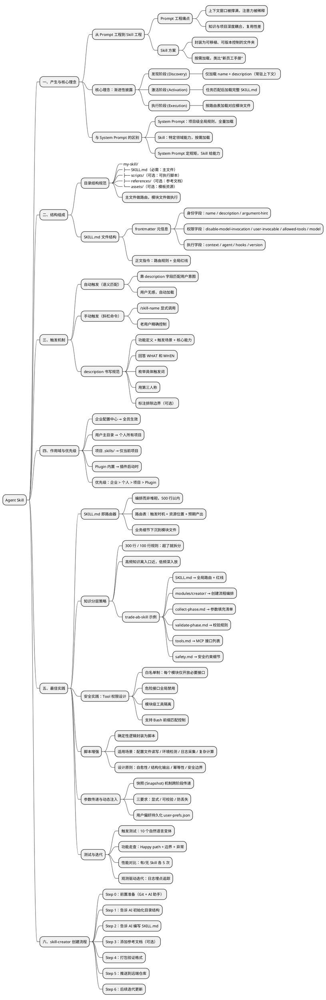

# Harness 工程之道：Skill 原理与最佳实践

https://mp.weixin.qq.com/s/yo2f5edeNNkYtCte9P0yhQ

## 核心速览表

| 主题     | 一句话概括                                                 |
| -------- | ---------------------------------------------------------- |
| 核心理念 | 渐进性披露 — 只在需要时加载需要的知识                      |
| 结构     | SKILL.md 做路由器，模块文件做执行                          |
| 触发     | 自动（语义匹配 description）+ 手动（斜杠命令）             |
| 作用域   | 企业 > 个人 > 项目 > Plugin                                |
| 最佳实践 | 路由编排、知识分层、工具隔离、脚本增强、快照传参、观测迭代 |
| 创建流程 | 全程描述意图，AI 负责执行（Vibe Coding）                   |
