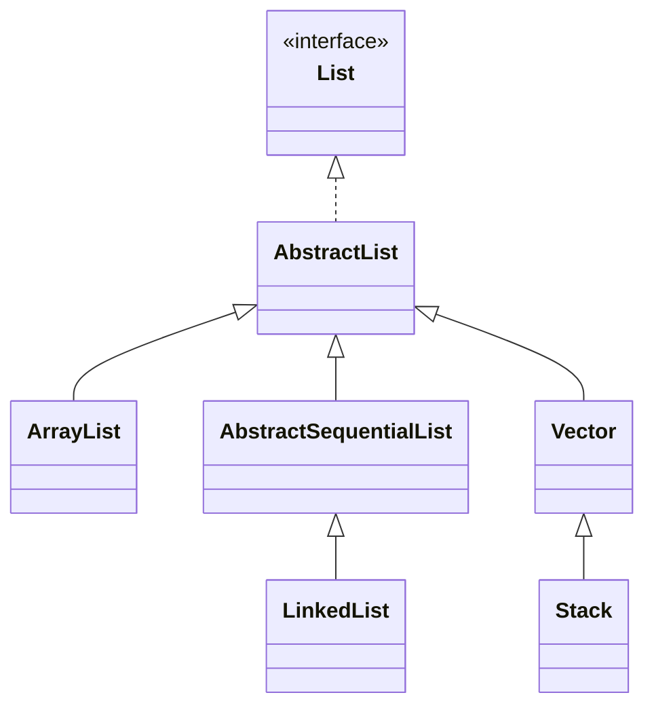
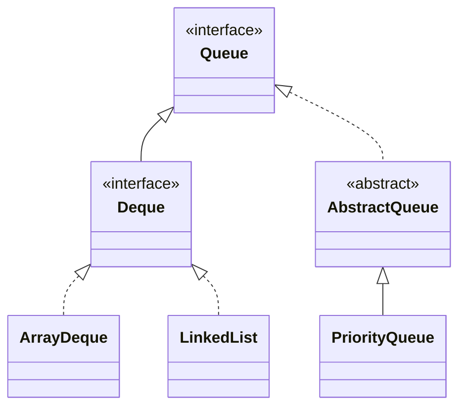
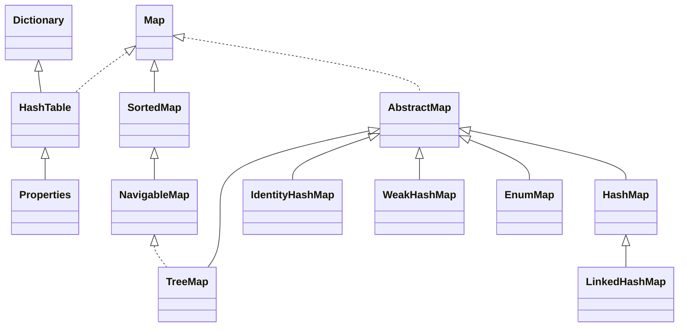
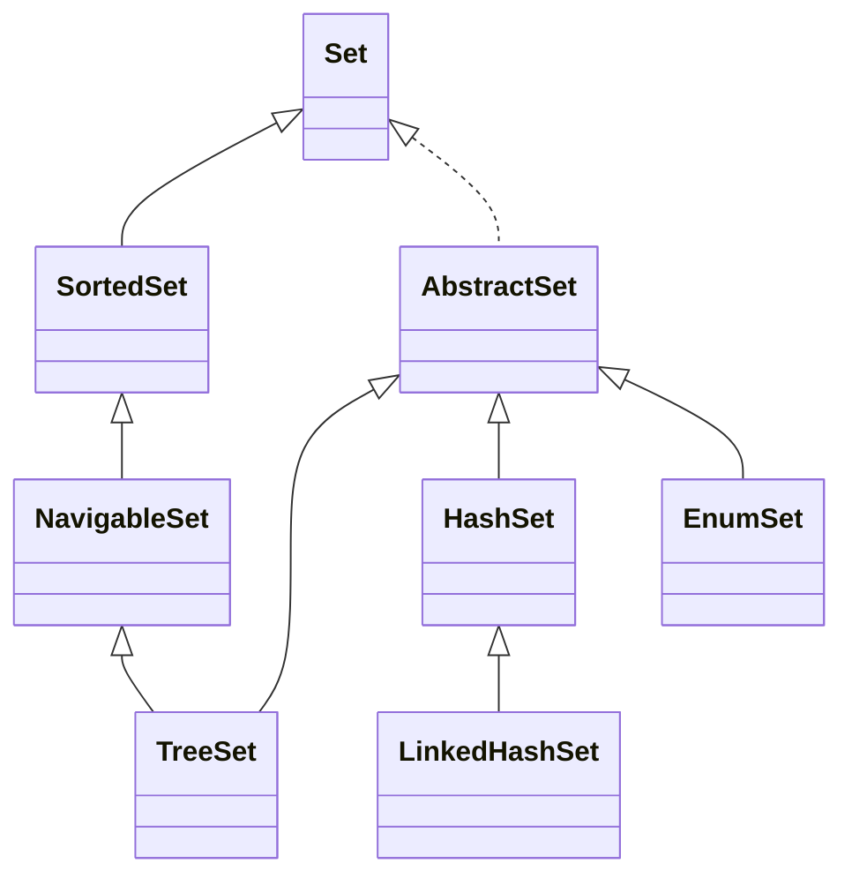

## 1.1 基础

### 基本数据类型

| 类型     | 字节 |
| -------- | ---- |
| byte     | 1    |
| short    | 2    |
| int      | 4    |
| long     | 8    |
| **char** | 2    |
| float    | 4    |
| double   | 8    |

### String

**底层实现:**

- java 9 将 char[] 改为了 byte[]
  String 支持两种编码方案：Latin-1 和 UTF-16
  Latin-1 编码下, byte 1 字节, char 2 字节
  可以节省空间

**运算符实现:**

- '+' '-' 运算符重载
  字节码中是使用的 StringBuilder

**解析 String s = new String("aa");**

- 首先字面量 "aa" 会在字符串常量池中创建一个对象
- new String("aa") 会在堆中创建一个 "aa" 的副本对象

**String.intern()**
常量池中有, 直接返回池中引用
常量池中没有, 在池中创建一个, 再返回其引用

### BitSet

BitSet 内部维护了一个 long[] words, 顺序地表示 1 到 (words.length \* 64)

> 每个 long 占用 64 位

### Object

- registerNatives() 类被加载的时候，调用该方法，以完成对其他本地方法的注册
- clone
- equals
- hashCode
- toString
- wait
- notify
- notifyAll
- @Deprecated(since="9") finalize

### 引用类型

1. 强引用(永久有效): 只要有强引用指向, 并且 GC Roots 可达, 那 GC 时就不会回收
2. 软引用(内存不足) SoftReference: OOM 前会加入回收范围; 主要用来缓存服务器中间计算结果和不需要实时保存的用户行为等
3. 弱引用(再次 YGC) WeakReference: 引用的对象在下一次 YGC 时回收
4. 虚引用(即时失效) PhantomReference: 定义完成后就无法通过该引用获取指向的对象. 使用虚引用的唯一目的是希望能在回收时收到系统的通知.
   必须与引用队列一起使用, 回收对象内存前会把虚引用加入引用队列中, 入队就算作通知

### exception error

exception 能被程序本身可以处理，error 是程序本身无法处理的(jvm 通常选择线程终止)
error 通常是虚拟机运行错误

### 受检异常和非受检异常

受检异常：编译时的异常  
非受检异常：RuntimeException 和 Error

### try catch finally

不要在 finally 语句块中使用 return, try 中的 return 值会被 finally 中 return 的覆盖

### try-with-resources

```java
try(Scanner scanner=new Scanner(new File("test.txt"))){}
```

### 泛型

泛型类: 实例化的时候必须指定类型
泛型接口: 继承的时候要指定类型
泛型方法

### SPI

SPI(Service Provider Interface), 服务提供者的接口
跟 API 有些类似, 但是接口由服务调用方规定, 然后通过 java.util.ServiceLoader 加载 /META-INF/services/接口名 文件中的全类名

> 例如 JDBC

### I/O

属于 OSI 中的表示层

字节流: InputStream OutputStream
FileInputStream

- BufferedInputStream
- DataInputStream
- ObjectInputStream

字符流: Reader Writer

为什么要有两种流:

- 字符流 JVM 将字节码转换得到的, 耗时
- 字节流不知道编码类型会出问题

java 调用 python 脚本的示例

> 展示 BufferedReader 的使用方式

```java
public class PythonSupport {

    public static void readLine() {
        Process process;
        String[] arg = {"python", "D:\\workbench\\source\\common\\practice\\src\\main\\resources\\regression.py",
                Arrays.toString(new int[]{0, 60, 120, 180, 240, 300, 360}),
                Arrays.toString(new int[]{1, 2, 3, 4, 5, 6, 7})};
        try {
            process = Runtime.getRuntime().exec(arg);
            try (BufferedReader reader = new BufferedReader(new InputStreamReader(process.getInputStream()))) {
                String line;
                while ((line = reader.readLine()) != null) {
                    System.out.println(line);
                }
            }
        } catch (IOException e) {
            throw new RuntimeException(e);
        }
        try {
            // 等待进程执行完成
            process.waitFor(3, TimeUnit.SECONDS);
        } catch (InterruptedException e) {
            throw new RuntimeException(e);
        }
    }

    public static void socketClient() throws IOException {
        String ip = "localhost";
        int port = 50007;
        try (Socket socket = new Socket(ip, port)) {
            try (OutputStreamWriter writer = new OutputStreamWriter(socket.getOutputStream())) {
                writer.write("[0, 60, 120, 180, 240, 300, 360]|[1, 2, 3, 4, 5, 6, 7]");
                writer.flush();
            }
            try (BufferedReader reader = new BufferedReader(new InputStreamReader(socket.getInputStream()))) {
                System.out.println(reader.readLine());
            }
        }
    }
}
```

#### 随机访问流

RandomAccessFile 可以实现大文件断点续传
RandomAccessFile.mode

- r
- rw
- rws 对文件和元数据的修改都会同步
- rwd 对文件的修改都会同步

RandomAccessFile.seek() 定位

#### I/O 中的设计模式

Decorator 装饰器模式

- 使用装饰器是因为子类太多了, 单独实现比较麻烦
- 增强: 比如 ZipOutputStream 增强 BufferedOutputStream

Adapter 适配器模式

- InputStreamReader OutputStreamReader 就是适配器
- 另外, Executors 的内部类 RunnableAdapter 实现也属于适配器，用于将 Runnable 适配成 Callable。

工厂模式

观察者模式

- Watchable.register(WatchService, WatchEvent.Kind<?>[])
  注册到 WatchService 进行事件监听

  - StandardWatchEventKinds.ENTRY_CREATE: 文件创建
  - StandardWatchEventKinds.ENTRY_DELETE: 文件删除
  - StandardWatchEventKinds.ENTRY_MODIFY: 文件修改

- register 返回 WatchKey, 可以获取对象的具体信息

- WatchService
  daemon Thread 守护线程轮询

#### I/O 模型

应用程序发起 I/O 调用后,会经历两个步骤:

1. 内核等待 I/O 设备准备好数据
2. 内核将数据从内核空间拷贝到用户空间

unix 系统下, 有 5 种 I/O 模型

- **同步阻塞**
  应用程序发起 read 调用后阻塞, 等待内核准备数据和拷贝数据

- **同步非阻塞**
  应用程序 read 轮询内核, 内核准备数据不阻塞, 拷贝数据阻塞

- **多路复用**
  应用程序发起 select 调用, 阻塞直到多个 socket 中任意一个变为可读, 然后发起 read 调用, 拷贝数据

- **信号驱动式 IO**
  应用程序建立信号, 让内核在描述符就绪时回调

- **异步**
  POSIX 规范, 让内核在整个操作完成的时候通知, 与信号驱动的区别在于内核的通知一个是何时可以启动 IO, 另一个是 IO 何时完成

Java 中的 3 种常见的 I/O 模型

- **BIO**
  应用程序发起 read 调用后, 阻塞, 直到内核把数据拷贝到用户空间
- **NIO**
  1.4 中引入的, 提供了 Channel Selector Buffer 等抽象
  可以看作多路复用模型
  ```mermaid
  graph LR;
  Server-->线程
  线程-->Selector
  Selector-->Channel0
  Channel0-->Buffer0
  Buffer0-->Channel0
  Buffer0-->Client0
  Client0-->Buffer0
  Selector-->Channel1
  Channel1-->Buffer1
  Buffer1-->Channel1
  Client1-->Buffer1
  Buffer1-->Client1
  ```
- **AIO**
  AIO 也就是 NIO 2。Java 7 中引入了 NIO 的改进版 NIO 2,它是异步 IO 模型。
  > Netty 尝试过 AIO, 效果一般

### 序列化协议

Kryo
Protobuf
ProtoStuff
hessian

### 获取 class 对象

```java
class C {
    // 1 已知class
    Class<Solution> aClass = Solution.class;
    // 2 未知class
    Class<?> bClass = Class.forName("packaege.com.leetcode.Solution");
    // 3 已知对象
    Class<? extends Solution> cClass = solution.getClass();
    // 4 类加载器 Class 对象不会初始化
    Class<?> dClass = ClassLoader.getSystemClassLoader().loadClass("packaege.com.leetcode.Solution");
}
```

### 代理模式

**静态代理**
目标类要写出代理类, 也就是说手动写出.java 文件

**动态代理**
动态生成字节码文件到 JVM

**JDK 动态代理** (模拟静态代理的方式, 代理类去实现接口)
核心:
java.lang.reflect.InvocationHandler.invoke()
java.lang.reflect.Proxy.newProxyInstance()

```java
/**
handler 会被 proxy 持有; 但 proxy 是个什么东西不好说, $Proxy0.toString(Unknown Source) 报错
*/
class MyHandler implements InvocationHandler {
    private final Object target;

    public MyHandler(Object target) {
        this.target = target;
    }

    @Override
    public Object invoke(Object proxy, Method method, Object[] args) throws Throwable {
        // do something
        // 注意这里是 target
        return method.invoke(target, args);
    }
}
```

```java
class ProxyFactory {
    public static Object getProxy(Object target) {
        return Proxy.newProxyInstance(
                target.getClass().getClassLoader(),
                target.getClass().getInterfaces(),
                new MyHandler(target)
        );
    }
}
```

```java
    public void main() {
        CommonInterface target = new Target();
        CommonInterface proxy = (CommonInterface) ProxyFactory.getProxy(target);
        proxy.func();
    }
```

**CGLib 动态代理**
net.sf.cglib.proxy.MethodInterceptor.intercept()
net.sf.cglib.proxy.Enhancer.create()

```java
class MyInterceptor implements MethodInterceptor {

    @Override
    public Object intercept(Object o, Method method, Object[] objects, MethodProxy methodProxy) throws Throwable {
        // do something
        return methodProxy.invokeSuper(o, objects);
    }
}
```

```java
class ProxyFactory {
    public static Object getProxy(Object target) {
        Enhancer enhancer = new Enhancer();
        enhancer.setClassLoader(target.getClass().getClassLoader());
        enhancer.setSuperclass(target.getClass());
        enhancer.setCallback(new MyInterceptor());
        return enhancer.create();
    }
}
```

```java
    public void main() {
        Target target = new Target();
        Target proxy = (Target) ProxyFactory.getProxy(target);
        proxy.func();
    }
```

### BigDecimal

浮点数据类型不能进行值的比较(== , equals), 因为存储了精度
BigDecimal.equals 也会比较精度

### Unsafe

单例模式, 获取的时候会校验类加载器, 必须是 PlatformClassLoader 才行
想获取有 2 种办法:

1. 通过反射获取
2. 将调用方的类路径通过 java -Xbootclasspath/a: ${path} 让引导类加载器加载

Unsafe 类的典型应用

- 内存操作
  应用: DirectByteBuffer 直接内存操作类
- 内存屏障
  指令重排可能引起 CPU 缓存中的数据和主存中的不一致, 内存屏障就是阻止屏障两边的指令重排

  ```java
  //禁止load操作重排序。屏障前的load操作不能被重排到屏障后，屏障后的load操作不能被重排到屏障前
  public native void loadFence();
  //禁止store操作重排序。屏障前的store操作不能被重排到屏障后，屏障后的store操作不能被重排到屏障前
  public native void storeFence();
  //禁止load、store操作重排序
  public native void fullFence();
  ```

  读屏障实例

  ```java
  class Solution {
    public static void main(String[] args) {
        @Getter
        class ChangeThread implements Runnable {
            /* volatile */ boolean flag = false;

            @Override
            public void run() {
                try {
                    Thread.sleep(1000);
                } catch (InterruptedException e) {
                    e.printStackTrace();
                }
                System.out.println("subThread flag:" + flag);
                flag = true;
                System.out.println("subThread change flag to:" + flag);
            }
        }

        ChangeThread changeThread = new ChangeThread();
        new Thread(changeThread).start();
        while (true) {
            // 主线程不断获取子线程的 flag, (主存中的 flag
            boolean flag = changeThread.isFlag();
            // getUnsafe().loadFence();
            if (flag) {
                System.out.println("detected flag changed");
                break;
            }
        }
        System.out.println("main thread end");
    }
  }
  ```

  应用: StampedLock 有{ 读 写 乐观读 }3 种模式, 乐观读的时候不会阻塞写锁, 通过 validate() 方法加入了读屏障,同步主存数据

- 对象操作
  普通读写 volatile 读写 有序写入
  创建对象 allocateInstance 不调用构造函数, 不执行初始化代码, JVM 不安全检查

- 数组操作
  应用: AtomicIntegerArray 中获取数组的起始偏移量和第一个元素的大小

- CAS 操作
  CAS(指令 cmpxchg) 乐观锁

- 线程调度

  - park / unpark 线程挂起
  - monitor 相关的操作已经废弃了
    应用: AbstractQueuedSynchronizer(AQS) 通过 LockSupport 的 park/unpark 实现线程的阻塞和唤醒

- class 操作
  静态属性

  - shouldBeInitialized 是不是应该实例化
  - staticFieldBase 获取静态属性的指针
  - staticFieldBase 获取静态属性的偏移量
    定义一个类
  - defineClass 会跳过所有的 JVM 检查
  - Lambda 表达式以前需要 ASM 动态生成字节码, 进而生成匿名类

- 系统信息
  - addressSize 获取系统指针大小
  - pageSize 获取内存页大小

### 语法糖

编译之后是什么呢?

- switch 支持 String 与枚举
- 泛型
- 自动装箱与拆箱
- 可变长参数
- 枚举
- 内部类
- 条件编译
- 断言
- 数值字面量
- for-each
- try-with-resource
- Lambda 表达式

### compare

java.lang.Comparable

- java.lang.Comparable#compareTo

java.util.Comparator

- java.util.Comparator#compare

## 1.2 集合

### List



- ArrayList  
  初始化 size=0, add 后变成**10**, 1.5 倍扩容

- LinkedList  
  双向链表, 头插 | 尾插

**线程安全的**

- CopyOnWriteArrayList 读的时候不加锁，写的时候加锁复制容器副本，写入并修改其引用
- Collections.synchronizedList(List list)
- Vector 跟 ArrayList 类似, 大部分方法被 synchronized 修饰, 2 倍扩容

### Queue



- Queue  
  Queue 一端进一端出  
  Deque 两端均可进出

  Queue interface 方法:(在空间不足的情况下)

  | runtime exception | no runtime exception |
  | ----------------- | -------------------- |
  | add(E)            | offer(E)             |
  | remove()          | poll()               |
  | element()         | peek()               |

- ArrayDeque

  - 可扩容数组
  - 不可存 null
  - 头尾操作高效，通过修改头尾的索引进行操作。
  - 内存效率好

- LinkedList  
  可存 null

### Map



- HashMap

  - 各版本实现方式

    - 1.7 数组+单链表

      > 如果一个桶中的元素过多，查询效率就是 O(n)

      1.7 Entry  
      1.7 使用头插法(认为后来的值查找可能性大)

      > 多线程状态下有可能出现环形链表

    - 1.8 数组+(单链表|红黑树) 查询效率最差是 O(logn)  
      1.8 Node  
      1.8 使用尾插法

  - JDK1.8 关键参数&扩容

    - 初始化
      ```java
      static final int tableSizeFor(int cap) {
        int n = cap - 1;
        n |= n >>> 1;
        n |= n >>> 2;
        n |= n >>> 4;
        n |= n >>> 8;
        n |= n >>> 16;
        return (n < 0) ? 1 : (n >= MAXIMUM_CAPACITY) ? MAXIMUM_CAPACITY : n + 1;
      }
      ```
    - putVal:
      > 如果 table 空，resize()
      > 如果桶里面没有数据，放进去
      > 如果第一个节点哈希值一样且 key 一样，说明已经在里面了
      > else if 是树节点，往树中添加节点
      > else if 是链表，从头到尾遍历，如果没有冲突就放到尾节点（如果大于等于 8 树形化）
      > 判断阈值是否要扩容
    - removeNode:
      > 计算 index, 如果为空返回 null
      > 如果第一个节点就是, 记录第一个节点
      > 如果不是, 且 next 不为 null, 判断第 1 个节点是树节点还是链表节点, 分别进行查找
      > 最后根据情况删除
    - resize:

      > if 旧容量不为 0, 两倍扩容;并且容量到 16, 新阈值也加倍
      > else if 旧容量为 0, 旧阈值不为 0, 新容量=旧阈值
      > else if 旧容量为 0, 旧阈值为 0, 那么都变成默认的  
      > if 新阈值为 0 (只有旧容量小于 16 或者旧容量 0&阈值不为 0 的两种情况下出现), 变成默认的
      > 遍历旧 table, 重新做 hash 散列

    - 容量
      初始化容量 16  
      loadFactor=0.75  
      threshold = capacity \* loadFactor = 12
      2 倍扩容

    - (单链表长度 >= 8) & (数组长度 >= 64) 变成红黑树

      > TREEIFY_THRESHOLD 桶的树化阈值 8  
      > MIN_TREEIFY_CAPACITY 最小树形化容量 64

    - 红黑树 node 数量 <= 6 变成单链表
      > UNTREEIFY_THRESHOLD 树的链表还原阈值 6

- 桶的树形化 treeifyBin()

  1. 根据 Hash 表中的元素个数决定是扩容还是树形化
  2. 遍历桶中的元素创建相同个数的树型节点，由单链表转为双链表再转为树形
  3. 让桶的第一个元素指向新建的树头结点

- put()  
  扩容 首先检测阈值, 扩容成 2 倍, 重新计算数组中的 index = key.hash & (length-1)  
  index = (n-1)&hash, n 是数组长度, 是 2 的幂次方, 则 n-1=11111  
  扩容为 2 倍的情况下，原来的 index 会在原位置或原位置+原 table 长度的位置

  ```c
  n-1:    0000 0000 1111
  hash1:  0101 0101 0101  ->  0101
  hash2:  0101 0100 0101  ->  0101

  n-1:    0000 0001 1111
  hash1:  0101 0101 0101  ->  1 0101
  hash2:  0101 0100 0101  ->  0 0101
  ```

- 多线程环境下的问题  
  1.7 多线程调用，resize 的时候有可能出现环形链表或者数据丢失:  
  未 resize 之前的节点 B 在 resize 的时候头插，而之前这个节点被它之前的节点 A 指向。这是 1.7 线程不安全最大的问题之一。  
  1.8 的 get/put 也没有加同步锁，无法保证多线程操作时上一时刻放进去的值 get 出来还是原值。

### Set



Set 是基于 Map 实现的，map 里面的 value 是：private static final Object PRESENT = new Object();

- LinkedHashSet 加了一条双向链表
- TreeSet 红黑树，可以有序地组织数据

### Collections

```java
// 排序
void reverse(List list)//反转
void shuffle(List list)//随机排序
void sort(List list)//按自然排序的升序排序
void sort(List list, Comparator c)//定制排序，由Comparator控制排序逻辑
void swap(List list, int i , int j)//交换两个索引位置的元素
void rotate(List list, int distance)//旋转。当distance为正数时，将list后distance个元素整体移到前面。当distance为负数时，将 list的前distance个元素整体移到后面
//查找 替换
int binarySearch(List list, Object key)//对List进行二分查找，返回索引，注意List必须是有序的
int max(Collection coll)//根据元素的自然顺序，返回最大的元素。 类比int min(Collection coll)
int max(Collection coll, Comparator c)//根据定制排序，返回最大元素，排序规则由Comparatator类控制。类比int min(Collection coll, Comparator c)
void fill(List list, Object obj)//用指定的元素代替指定list中的所有元素
int frequency(Collection c, Object o)//统计元素出现次数
int indexOfSubList(List list, List target)//统计target在list中第一次出现的索引，找不到则返回-1，类比int lastIndexOfSubList(List source, list target)
boolean replaceAll(List list, Object oldVal, Object newVal)//用新元素替换旧元素
```
