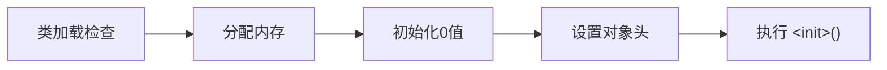

# 深入理解 Java 虚拟机: JVM 高级特性与最佳实践

JVM 相关的知识可以分为几部分:

- 内存结构
- 垃圾回收器
- 执行子系统
  - 类文件结构
  - 类加载
  - 字节码执行

java -XX:+PrintCommandLineFlags ：查看当前
java -XX:+PrintFlagsInitial ：查看所有默认值
java -XX:+PrintFlagsFinal ：查看所有实际值

# 第一部分 走近 Java

## 第 1 章 走近 Java

### Java 技术体系

虽然我们用 Java，写 Java，但是 Java 技术体系的组成或许不是很明确。
通常以 JDK 代指整个 Java 技术体系：

- JDK: Java 程序设计语言、Java 虚拟机、Java 类库
- JRE: Java 类库 API 中的 Java SE API 子集、Java 虚拟机

如果按照 Java 应用的领域划分，那么有四条主要的产品线：

- Java Card
- Java ME
- Java SE：桌面
- Java EE：JDK 10 以后被 Oracle 放弃，捐给 Eclipse 基金会管理，不准用 Java 商标，改名叫 Jakarta EE

### Java 发展史

波澜壮阔，可以当小说看

### Java 虚拟机家族

始祖 Sun Classic/Exact VM
武林盟主 HotSpot VM
天下第二 BEA JRockit/IBM J9 VM
还有很多

### Java 的未来

**无语言倾向**
Graal VM: 支持多种语言，可以将源代码或源代码编译后的中间格式通过解释器转化为 VM 可以理解的中间表示。

**即时编译器**
热点代码探测，编译为机器码。HotSpot 虚拟机中含有两个即时编译器

- 编译耗时短但输出代码优化程度较低的客户端编译器（简称为 C1）
- 编译耗时长但输出代码优化质量也更高的服务端编译器（简称为 C2）
- JDK 10 起，实验功能新加入了 Graal 编译器，以替代 C2

**native 化**
提前编译，相对于即时编译的概念，提前将源码编译成二进制库，直接调用。
Graal VM 0.20 版本里新出现的一个极小型的运行时环境，Substrate VM，以代替 HotSpot 支持提前编译后的程序执行。
显著降低内存占用和启动时间。

**如何面对逐渐臃肿的源码**

- 模块化
- 接口与实现的分离

---

# 第二部分 自动内存管理

## 第 2 章 Java 内存区域与内存溢出异常

### 运行时数据区域

**线程私有**

- 程序计数器
  记录正在执行的字节码指令的地址，是当前线程执行字节码的行号指示器
  如果执行的是本地方法，值为 Undefined

- 虚拟机栈

  - 局部变量表(基本数据类型 对象引用 returnAddress)
    这些数据的存储空间局部变量槽表示，long 和 double 2 个槽，其他 1 个槽。槽位数量在编译期就确定了。
    HotSpot 不能动态扩展栈容量，只有申请栈空间的时候会出现 OOM
  - 操作数栈
  - 动态链接
  - 方法出口

- 本地方法栈
  HotSpot 将虚拟机栈和本地方法栈合二为一

**线程共享**

- 堆
  G1 作为分水岭，G1 之前是经典的分代设计

- 方法区
  存储 类型信息、常量、静态变量、即时编译器编译后的代码缓存等
  JDK 7 及以前，HotSpot 用永久代实现方法区。这并不是一个好设计(空间大小限制，容易 OOM)，给 JRocket 合并带来了困难。
  JDK 7 的时候，把字符串常量池和静态变量从永久代移到了堆空间。

  > String intern() 在 JDK 6 和 JDK 7 中的表现不同

  JDK 8 把剩余的内容(主要是类型信息), 都移到了元空间(用本地内存实现)。

  - 运行时常量池
    Class 文件中的常量池表存放着编译后生成的各种字面量和符号引用，运行期新的常量也可以放常量池。
    例如 String intern()方法将常量池中对象的引用返回，或者将新创建的 String 对象加入常量池中，并返回常量池中对象的引用。

- 直接内存
  并非虚拟机规范定义的区域
  JDK 1.4 引入了 NIO，可以使用 Native 函数库直接分配堆外内存，通过一个 DirectByteBuffer 对象作为该内存的引用进行操作。避免来在 Java 堆和 Native 堆来回复制数据。

### HotSpot 对象管理

#### 对象初始化



分配内存

- 方法
  - 指针碰撞
  - 空闲列表
- 线程安全
  - 同步处理(CAS+重试)
  - 本地线程分配缓冲（Thread Local Allocation Buffer，TLAB）每个线程在堆中预先分配一小块内存。
    可以通过 -XX：+/-UseTLAB 参数设定

执行\<init>()方法：由字节码流中 new 指令后面是否跟随 invokespecial 指令决定，一般 new 完直接 init。

> Java 编译器会在遇到 new 关键字的地方同时生成 new 和 invokespecial 字节码指令，但如果直接通过其他方式产生的则不一定如此。

#### 对象内存结构

1. 对象头(大小为 8 byte 的 1 倍或 2 倍)

   - 对象运行时数据：
     哈希码（HashCode）、GC 分代年龄
     偏向标记、偏向线程 ID、偏向时间戳
     锁状态标志、指向锁的指针
   - 类型指针

2. 实例数据

3. 对齐填充
   使得起始地址为 8 byte 的整数倍

#### 对象的访问定位

虚拟机规范也没有定义，所以还是看虚拟机的实现

- 直接指针
  指向对象，对象要包含指向类型数据的指针
  好处是仅访问对象时省去一次寻址

- 句柄
  **堆**中设置句柄池，句柄分别指向对象实例数据和对象类型数据
  好处是不用对象移动的时候修改引用本身，修改句柄即可

HotSpot 的实现方案主要是直接指针，但使用了 Shenandoah 收集器也会使用句柄

#### OOM 实战

- 堆
  -Xms20m -Xmx20m
  通过参数开启转储堆快照
  -XX：+HeapDumpOnOutOfMemoryError
  Dump 出来的快照可以用 Eclipse Memory Analyzer 打开，首先第一步要确定是内存泄漏还是内存溢出
  - 如果是泄露，可以通过工具查看对象的 GC Root 引用链，找出泄露代码的位置
  - 如果不是泄露，考虑调整大小，考虑减少对象的生命周期
    <br/>
- 栈
  -Xss128k
  单线程下，无论是设置栈空间很小还是栈帧很大，都是 StackOverflow。正常方法调用栈深度 1-2K 是没有问题的，即便没有尾递归优化。
  多线程下，不断创建线程能制造 OOM，而且主要取决于 OS 本身的内存使用状态。
  也就是说，限制了内存区域后，栈空间也会受到 JVM (总空间-堆空间-方法区) 的限制，给每个栈分配的空间越大越容易 OOM。
  <br/>
- 方法区
  自打 JDK 8 方法区的实现变为元空间开始，就很难 OOM 了
  一些调节元空间的参数：
  -XX：MaxMetaspaceSize 元空间最大值，默认-1
  -XX：MetaspaceSize 初始空间大小(字节)，到达后会 GC 并自动调整这个设置，如果 GC 的空间多会调小(增加 GC 频率)
  -XX：MinMetaspaceFreeRatio GC 后计算空余空间占 GC 阈值空间的比值，如果空闲比小于这个参数(也就是说 GC 的太少, 要减少 GC 频率)，就会调大 MetaspaceSize
  <br/>
- 直接内存
  -XX：MaxDirectMemorySize 默认与-Xmx 一致
  虽然使用 DirectByteBuffer 分配内存也会抛出内存溢出异常，但它抛出异常时并没有真正向操作系统申请分配内存，而是通过计算得知内存无法分配就会在代码里手动抛出溢出异常，真正申请分配内存的方法是 Unsafe::allocateMemory()。
  一个明显的特征是在 Heap Dump 文件中不会看见有什么明显的异常情况，如果发现内存溢出之后产生的 Dump 文件很小，而程序中又直接或间接使用了 DirectMemory(典型的间接使用就是 NIO)，那么。。。

---

## 第 3 章 垃圾收集器与内存分配策略

### 对象的死亡

- 引用计数
- 可达性分析
  GC Root 引用链是否可达
  Root:
  - 虚拟机栈：里面局部变量表引用的对象
  - 本地方法栈：JNI 引用的对象
  - 方法区：类静态属性 常量
  - 虚拟机内部的引用
  - synchronized 持有的对象
  - 还有一些临时性的 Roots，局部回收时被其他内存区域引用

**对象死亡前的二次拯救**
如果对象没有覆盖 finalize()方法，或者 finalize()方法已经被 JVM 调用过，就不会执行 finalize()方法，直接回收了；
如果要执行 finalize()方法，会放到一个 F-Queue 队列里，然后 Finalizer 线程会执行队列中对象的 finalize() 方法，但不阻塞。
**随后**收集器会二次标记队列中的对象，如果二次标记的时候对象没有与引用链链接，就要被回收了。
当然，这玩意不推荐使用。

**对象引用**

- 强
- 软 OOM 前二次回收
- 弱 活到下一次 GC
- 虚 PhantomReference 根据引用获取不到对象，设置的唯一目的是回收时收到一个系统通知。

### 回收方法区

虚拟机规范不要求回收方法区，JDK 11 时期的 ZGC 收集器就不支持类卸载。

通常回收两部分，一部分是常量，另一部分是类
常量只要没有引用就可以回收，而类复杂很多， 要满足三个条件：

- 所有实例被回收
- 该类的类加载器被回收 (精心设计的类加载器才可以)
- 对应的 class 对象没有被引用，无法通过反射访问该类的方法

### 垃圾收集算法

经典分代收集基于两个假说：

1. 绝大多数对象的生命都很短暂
2. 越能熬的对象越难消亡

基于这两个假说才有了经典的分代设计。

3. 跨代引用相对于同代引用来说仅占极少数
   为解决普遍存在的跨代引用问题诞生的第三条假说，在新生代中维护一块 Remembered Set, 这个结构会记录老年代中哪块内存有跨代引用，这些块中的对象会加入到引用链。虽然运行时会有记录开销，但是比扫描整个老年代划算。

**收集行为分类**

- 部分 GC
  - Y GC
  - Old GC 只收集老年代 只有 CMS
  - Mixed GC 全部新生代，部分老年代 只有 G1
- Full GC

**标记清除**
有两个缺点，效率不稳定(标记清除大量对象)；内存碎片化；

**标记复制**
如果回收效率高那当然是不错的。内存规整，但有空间浪费；
Appel 式(半区复制)回收：
80% Eden，2\*10% Survivor，每次都清除 Eden 和 1 个 Survivor。
如果剩余的对象比 1 个 Survivor 大，通过分配担保机制直接进入老年代。

**标记整理**
标记后将存活的对象移动到一端，然后清掉边界以外的内存。
移动对象是个比较重的操作，跟标记清除相比，清除需要在碎片化的内存中分配内存，而整理需要小心翼翼地回收内存。
换句话说，清除分配内存更复杂，整理回收内存更复杂。
在内存操作上，分配内存更频繁，而回收相对不那么频繁；分配内存停顿时间短，回收停顿时间久。
关注吞吐量的 Parallel Old 收集器是基于标记-整理算法的，而关注延迟的 CMS 收集器则是基于标记-清除算法的，也可以侧面印证这一点。

### HotSpot GC 算法详解

#### 根节点枚举

枚举根节点必须要停顿，根节点太多了，不会真正地去枚举根节点
通过指令中的 OopMap 结构维护引用完成根节点枚举
OopMap{ebx=Oop [16]=Oop off=142}

#### 安全点

线程到达安全点之后才会 STW, 生成 OopMap。主动式中断会设置一个标志位，每个线程执行的时候会去轮询，如果发现标志位为真则主动在安全点挂起。
安全点的选取通常在长时间执行的位置，也就是指令复用的位置，如方法调用 循环跳转等。

#### 安全区域

在线程 block 或 sleep 的时候，线程没有在执行, 显然是不能用安全点的。这时候需要安全区域.
安全区域指能够确保一段代码片段中，引用关系不会发生变化。
线程执行进入安全区域时，会标识自己，这样 JVM 垃圾收集的时候就不必考虑这些线程造成的影响啦
当线程离开时，会检查虚拟机是否已完成根节点枚举(或者其他 STW)，如果没完成会等待，直到收到通知。

#### remembered set 与 卡表

记忆集是个抽象概念，卡表可以算是具体实现(类似 Map 与 hashMap)。还有其他精度的实现(字长精度 对象精度)
HotSpot 里面卡表是个字节数组

```c
CARD_TABLE [address >> 9] = 0; // 除512
```

其中代表的内存块称为卡页，如上可知，HotSpot 卡页大小$2^9$，也就是 512 字节(不是位)。

> 例如 第 1 页代表内存区域 0x0000~0x01FF bytes

卡表在新生代中， 避免老年代的全量扫描
页中是地址空间，如果这些空间中的对象包含跨代引用，就标记为脏页，并加入 GC Root 扫描

#### 写屏障

如何维护卡表的问题。
解释执行字节码还好，在即时编译的场景，需要在执行机器指令流时添加。

写屏障跟切面相似，在 G1 出现之前，其他收集器都只用了写后屏障。
写屏障有一定的开销，但是比扫描整个老年代还是要好很多。

**伪共享**
在高并发场景下，还会有伪共享(false sharing)的问题，CPU 缓存的共享处理(写回 无效化 或 同步)导致性能降低。
所以只标记未标记过的卡表元素

```c
if (CARD_TABLE [this address >> 9] != 0)
    CARD_TABLE [this address >> 9] = 0;
```

在 JDK 7 之后，HotSpot 虚拟机增加 -XX：+UseCondCardMark，用来决定是否开启卡表更新的条件判断。开启会增加一次额外判断的开销，但能够避免伪共享问题。两者各有性能损耗，是否打开要根据应用实际运行情况来进行测试权衡。

#### 可达性分析

三色算法

- 白色：该对象未被垃圾回收器访问过，如果标记结束还是白色，代表不可达
- 黑色：该对象已被垃圾回收器访问过，并且它的引用也都被访问过
- 灰色：该对象已被垃圾回收器访问过，但它的引用没有全部被访问过

并发标记可能产生误标(指黑为白)的充要条件：(很容易理解)

- 赋值器插入了一条或多条 黑色==>白色 的新引用 // 白色加到了链上
- 赋值器删除了全部 灰色==>该白色 的直接或间接引用 // 还没扫白色就断开了对它的引用

那么避免对象小时的问题只需要破坏这两个条件即可。由此产生了两种解决方案：(都通过写屏障实现)

- 增量更新：黑色对象新增白色引用，变为灰色 (记录下来黑色对象，重新遍历) CMS
- 原始快照：灰色对象删除白色引用，重新扫描灰色对象 G1

---

至此，HotSpot JVM 如何发起内存回收、如何加速内存回收，以及如何保证回收正确 的问题介绍完毕。

### 经典垃圾收集器

> 这里用关系型数据表来表示

| 对应情况      | Young gen         | Tenured gen  | all gen |
| ------------- | ----------------- | ------------ | ------- |
|               | Serial            | Serial Old   |         |
|               | Parallel Scavenge | Serial Old   |         |
|               | Parallel Scavenge | Parallel Old |         |
|               | ParNew            | CMS          |         |
|               |                   |              |         |
| JDK8 声明废弃 | Serial            | CMS          |         |
| JDK8 声明废弃 | ParNew            | Serial Old   |         |
|               |                   |              | G1      |

> 在这个语义中,
> **并发**可以认为是用户线程跟收集线程同时在运行;
> **并行**可以认为是多个收集线程同时在运行。

#### 新生代 Serial

标记复制
JDK 1.3.1 之前没有其他选项
Stop The World
简单, 资源消耗少, 是客户端的首选

#### 新生代 ParNew

标记复制
并行版的 Serial, 只有它能跟 CMS 配合.
现在它存在的意义就是适配 CMS

#### 新生代 Parallel Scavenge

标记复制
跟 ParNew 很像，目标是高吞吐，适合后台程序。

设定停顿目标秒数 (牺牲吞吐量和新生代空间大小
-XX: MaxGCPauseMillis

收集时间占比
-XX: GCTimeRatio

自适应调节策略
-XX: UseAdaptiveSizePolicy

#### 老年代 Serial Old

标记整理

#### 老年代 Parallel Old

标记整理
是 scavenge 的老年代版本。也只能配合 scarvenge 使用
没有它之前, Parallel scavenge 没有可以配合的老年代回收器

#### CMS

标记清除

1. 初始标记
   标记与 Root 直接关联的对象
2. 并发标记
   波浪式扫描
3. 重新标记
   增量更新(通过写屏障，记录增加了白色引用的黑色对象
4. 并发清除

三大缺点：

1. 对处理器资源敏感
   回收线程数=(核心数+3)/4
   增量式并发收集器 (增加 GC 时间，减少速度下降幅度) 也不咋好使，废弃了
2. 浮动垃圾问题
   并发标记和并发清理阶段会产生浮动垃圾，因为并发收集过程中需要不 STW, 所以要预留足够的内存空间，也就不能等快满的时候 GC。如果预留的空间不足，就会引发“并发失败”, 会使用 Serial Old 重新 GC。
3. 空间碎片
   标记清除导致的空间碎片化。可以设置开启内存整理，不过整理过程不能并发

#### G1

整体上看是标记整理，局部上看是标记复制
划时代的混合 GC 模式。
开创了基于 Region 的堆内存布局，把连续的堆划分为多个大小相等的独立区域 Region，每一个区域都可以作为 Eden Survivor 或者老年代。

大对象(超过 Region 一半)都放进 Humongous 区域，可以多个 Humongous 放一个大对象。

G1 收集器会跟踪回收价值--就是回收释放的空间和所需时间的经验值。然后维护一个优先级列表，根据用户设定的允许停顿时间优先回收价值最大的区域。

折腾了 8 年的 G1 面临的问题也是非常之多：

- **跨代引用问题**
  其实也是 remembered set，不过本质上的实现是个哈希表：
  key 是别的 Region 的起始地址，val 是个集合，里面的元素是卡表的索引号
- **并发标记如何实现**
  原始快照，灰色删除白色，重新扫描灰色
  每个 Region 会为新对象预留一部分空间，通过两个指针，新对象都在这两个指针之上，回收不会回收新对象
- **可靠的停顿模型怎么建立**
  以衰减均值作为理论基础，本质上是根据统计数据

运行过程：

1. 初始标记
   跟 CMS 差不多，加了个指针移动
2. 并发标记
   原始快照
3. 最终标记
4. 筛选回收
   根据设定的停顿时间，制定回收计划，存活的对象复制到另外的 Region，然后清空 Region

#### G1 vs CMS

优势：

- 最大停顿时间设定
- 按收益动态确定回收集
- 算法理论，更少的内存碎片化

劣势：资源消耗

- remembered set 空间消耗
- 卡表的复杂度让写屏障太复杂，写前写后都有，甚至用上了异步队列

### 低延迟垃圾收集器

垃圾收集器指标三项:

- 内存占用
- 吞吐量
- 延迟

现阶段更关注延迟, 另外两个指标会随着硬件提升而提升

#### Shenandoah

非官方的收集器，OpenJDK 能用，OracleJDK 不能用。。
跟 G1 很像，区别大致有三点：

1. 并发整理
2. 不分代
3. 弃用 Remebered Set 使用全局的 Region "连接矩阵"

运行过程：

1. 初始标记
2. **并发标记**
3. 最终标记
4. 并发清理
   回收纯的垃圾 Region
5. **并发回收**
   核心差异所在，Brooks Pointer：类似句柄，在对象头前面维护一个指针，并发时进行定向
6. 初始引用更新
7. **并发引用更新**
   沿内存物理地址顺序线性搜索，修改为新引用
8. 最终引用更新
9. 并发清理

还有些别的乌七八糟的内容，先不管了

#### ZGC

基于 Region 内存布局的，不设置分代的，使用读屏障、染色指针和内存多重映射实现可并发的标记整理算法的，以低延迟为首要目标的一款垃圾收集器。
Region 有动态性，动态创建销毁，动态容量大小。

- 小型： 固定 2MB, 放置小于 256KB 的对象
- 中型：固定 32MB, 放置大于 256KB 小于 4MB 的对象
- 大型：不固定，大小为 2MB 的整数倍。只放置一个大对象，最小可以为 4MB, 可小于中型

**染色指针技术**：
64 位机器的内存地址高 18 位不能用于寻址，剩下的 46 位的高 4 位用于存储了 4 个标志信息( 三色标记状态，是否进入了重分配集，是否只能通过 finalize()访问 )
这样内存空间只能支持 4T
为了配合染色指针，才选择了多重映射

优势：

1. Region 中存活对象移走后可以马上回收
2. 使用内存屏障少
3. 4 位的占用有优化空间

内容繁多，懒得管了，不过性能很牛逼

### 选择合适的收集器

#### Epsilon 收集器

---

## 第 4 章 虚拟机性能监控 故障处理工具

---

## 第 5 章 调优案例分析与实战

---

# 第三部分 虚拟机执行子系统

## 第 6 章 类文件结构

---

## 第 7 章 虚拟机类加载机制

---

## 第 8 章 虚拟机字节码执行引擎

---

## 第 9 章 类加载及执行子系统的案例与实战

---

# 第四部分 程序编译与代码优化

## 第 10 章 前端编译与优化

源码编译成字节码

---

## 第 11 章 后端编译与优化

字节码编译成本地机器码

---

# 第五部分 高效并发

## 第 12 章 Java 内存模型与线程

---

## 第 13 章 线程安全与锁优化

---
