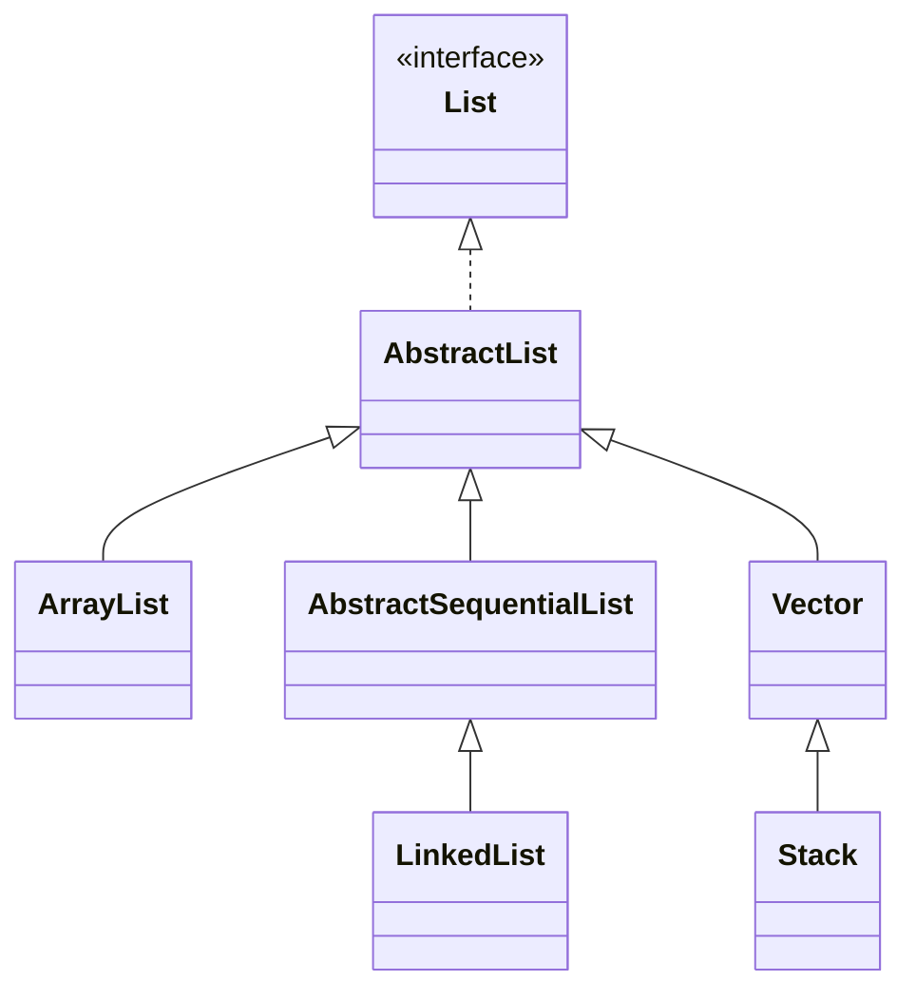
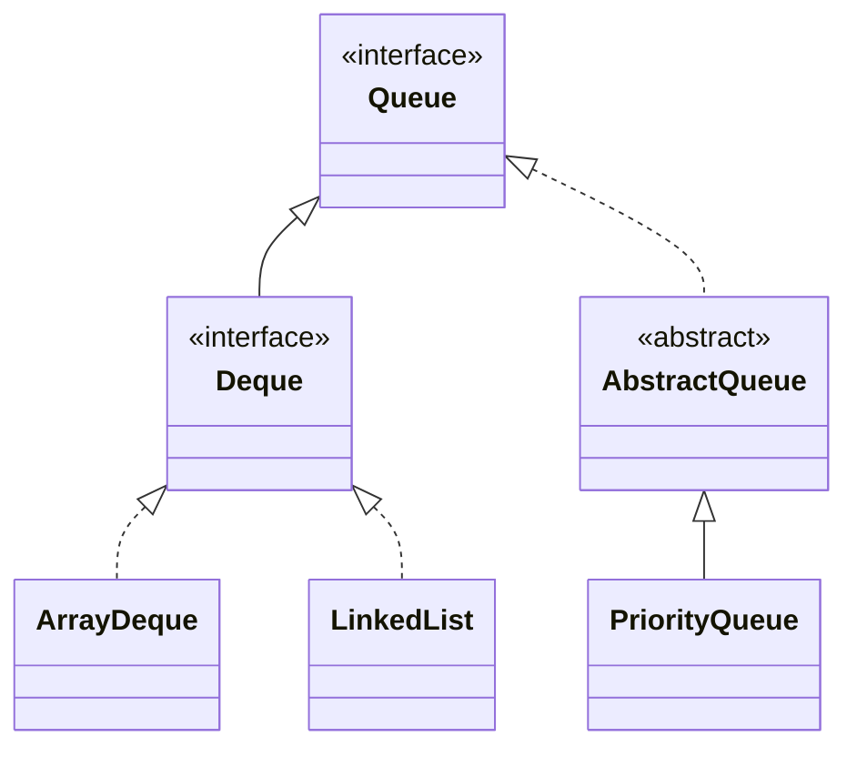
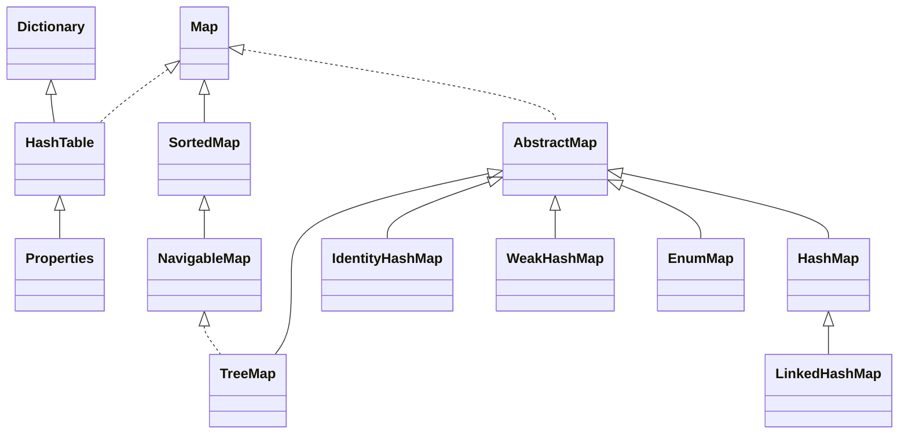
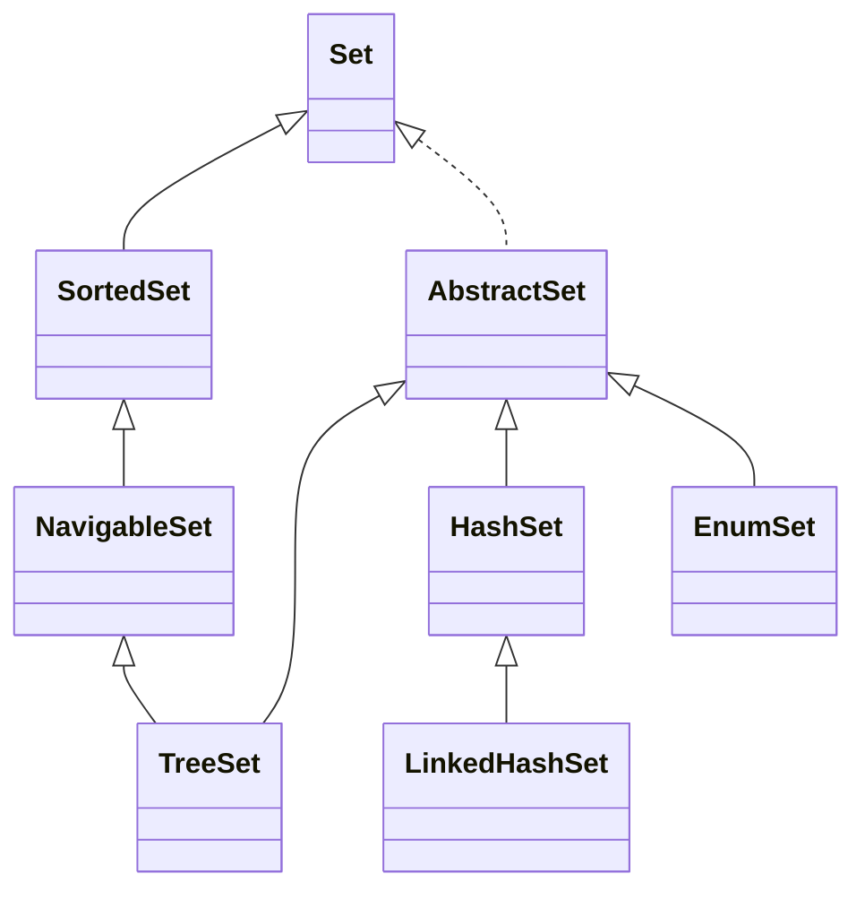

# 集合

## List



- ArrayList  
  初始化 size=0, add 后变成 **10**, 1.5 倍扩容

- LinkedList  
  双向链表, 头插 | 尾插

**线程安全的**

- CopyOnWriteArrayList 读的时候不加锁，写的时候加锁复制容器副本，写入并修改其引用
- Collections.synchronizedList(List list)
- Vector 跟 ArrayList 类似, 大部分方法被 synchronized 修饰, 2 倍扩容

## Queue



- Queue  
  Queue 一端进一端出  
  Deque 两端均可进出

  Queue interface 方法:(在空间不足的情况下)

  | runtime exception | no runtime exception |
  | ----------------- | -------------------- |
  | add(E)            | offer(E)             |
  | remove()          | poll()               |
  | element()         | peek()               |

- ArrayDeque

  - 可扩容数组
  - 不可存 null
  - 头尾操作高效，通过修改头尾的索引进行操作。
  - 内存效率好

- LinkedList  
  可存 null

## Map



- HashMap

  - 各版本实现方式

    - 1.7 数组+单链表

      > 如果一个桶中的元素过多，查询效率就是 O(n)

      1.7 Entry  
      1.7 使用头插法(认为后来的值查找可能性大)

      > 多线程状态下有可能出现环形链表

    - 1.8 数组+(单链表|红黑树) 查询效率最差是 O(logn)  
      1.8 Node  
      1.8 使用尾插法

  - JDK1.8 关键参数&扩容

    - 初始化
      ```java
      static final int tableSizeFor(int cap) {
        int n = cap - 1;
        n |= n >>> 1;
        n |= n >>> 2;
        n |= n >>> 4;
        n |= n >>> 8;
        n |= n >>> 16;
        return (n < 0) ? 1 : (n >= MAXIMUM_CAPACITY) ? MAXIMUM_CAPACITY : n + 1;
      }
      ```
    - putVal:
      > 如果 table 空，resize()
      > 如果桶里面没有数据，放进去
      > 如果第一个节点哈希值一样且 key 一样，说明已经在里面了
      > else if 是树节点，往树中添加节点
      > else if 是链表，从头到尾遍历，如果没有冲突就放到尾节点（如果大于等于 8 树形化）
      > 判断阈值是否要扩容
    - removeNode:
      > 计算 index, 如果为空返回 null
      > 如果第一个节点就是, 记录第一个节点
      > 如果不是, 且 next 不为 null, 判断第 1 个节点是树节点还是链表节点, 分别进行查找
      > 最后根据情况删除
    - resize:

      > if 旧容量不为 0, 两倍扩容;并且容量到 16, 新阈值也加倍
      > else if 旧容量为 0, 旧阈值不为 0, 新容量=旧阈值
      > else if 旧容量为 0, 旧阈值为 0, 那么都变成默认的  
      > if 新阈值为 0 (只有旧容量小于 16 或者旧容量 0&阈值不为 0 的两种情况下出现), 变成默认的
      > 遍历旧 table, 重新做 hash 散列

    - 容量
      初始化容量 16  
      loadFactor=0.75  
      threshold = capacity \* loadFactor = 12
      2 倍扩容

    - (单链表长度 >= 8) & (数组长度 >= 64) 变成红黑树

      > TREEIFY_THRESHOLD 桶的树化阈值 8  
      > MIN_TREEIFY_CAPACITY 最小树形化容量 64

    - 红黑树 node 数量 <= 6 变成单链表
      > UNTREEIFY_THRESHOLD 树的链表还原阈值 6

- 桶的树形化 treeifyBin()

  1. 根据 Hash 表中的元素个数决定是扩容还是树形化
  2. 遍历桶中的元素创建相同个数的树型节点，由单链表转为双链表再转为树形
  3. 让桶的第一个元素指向新建的树头结点

- put()  
  扩容 首先检测阈值, 扩容成 2 倍, 重新计算数组中的 index = key.hash & (length-1)  
  index = (n-1)&hash, n 是数组长度, 是 2 的幂次方, 则 n-1=11111  
  扩容为 2 倍的情况下，原来的 index 会在原位置或原位置+原 table 长度的位置

  ```c
  n-1:    0000 0000 1111
  hash1:  0101 0101 0101  ->  0101
  hash2:  0101 0100 0101  ->  0101

  n-1:    0000 0001 1111
  hash1:  0101 0101 0101  ->  1 0101
  hash2:  0101 0100 0101  ->  0 0101
  ```

- 多线程环境下的问题  
  1.7 多线程调用，resize 的时候有可能出现环形链表或者数据丢失:  
  未 resize 之前的节点 B 在 resize 的时候头插，而之前这个节点被它之前的节点 A 指向。这是 1.7 线程不安全最大的问题之一。  
  1.8 的 get/put 也没有加同步锁，无法保证多线程操作时上一时刻放进去的值 get 出来还是原值。

## Set



Set 是基于 Map 实现的，map 里面的 value 是：private static final Object PRESENT = new Object();

- LinkedHashSet 加了一条双向链表
- TreeSet 红黑树，可以有序地组织数据

## Collections

```java
// 排序
void reverse(List list)//反转
void shuffle(List list)//随机排序
void sort(List list)//按自然排序的升序排序
void sort(List list, Comparator c)//定制排序，由Comparator控制排序逻辑
void swap(List list, int i , int j)//交换两个索引位置的元素
void rotate(List list, int distance)//旋转。当distance为正数时，将list后distance个元素整体移到前面。当distance为负数时，将 list的前distance个元素整体移到后面
//查找 替换
int binarySearch(List list, Object key)//对List进行二分查找，返回索引，注意List必须是有序的
int max(Collection coll)//根据元素的自然顺序，返回最大的元素。 类比int min(Collection coll)
int max(Collection coll, Comparator c)//根据定制排序，返回最大元素，排序规则由Comparatator类控制。类比int min(Collection coll, Comparator c)
void fill(List list, Object obj)//用指定的元素代替指定list中的所有元素
int frequency(Collection c, Object o)//统计元素出现次数
int indexOfSubList(List list, List target)//统计target在list中第一次出现的索引，找不到则返回-1，类比int lastIndexOfSubList(List source, list target)
boolean replaceAll(List list, Object oldVal, Object newVal)//用新元素替换旧元素
```
