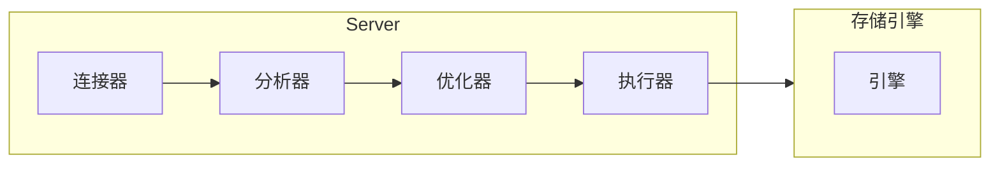

# 突击 MySQL

## 一条 SQL 是怎样执行的？

### MySQL 基础架构

> 一条 SQL 是怎样执行的？可以先从 MySQL 架构谈起。



#### 连接器

连接器负责跟客户端建立连接、获取权限、维持和管理连接。

**如何连接**

连接命令：

```sh
mysql -h$ip -P$port -u$user -p
```

命令中的 `mysql` 是客户端工具。

- 如果用户名或密码不对，你就会收到一个`Access denied for user`的错误，然后客户端程序结束执行。
- 如果用户名密码认证通过，连接器会到权限表里面查出你拥有的权限。之后这个连接里面的权限判断逻辑，都将依赖于此时读到的权限。

**管理连接**

```sh
show processlist;
```

结果中的 Command 列显示为“Sleep”, 代表一个空闲连接。

参数 wait_timeout 控制断连时间，默认 8 小时。断连后，如果客户端发送请求，会会收到错误提醒：`Lost connection to MySQL server during query`

建立的连接可以分为长连接和短连接，长连接可以避免建立连接的开销，但随着执行，连接会持有很多对象占用大量内存造成 OOM, 解决这个问题有 2 种方案，一种是可以定期断开连接；另一种是 5.7 及以上版本可以通过命令`mysql_reset_connection`初始化连接资源。

#### 缓存

MySQL 8.0 就没有了。  
只要对表有修改，所有缓存都会失效。所以只有那些静态表适合用缓存，MySQL 支持显式指定哪个 sql 使用缓存。

#### 分析器

分析器做词法分析和语法分析

- 词法分析，识别关键词
- 语法分析，语法校验

#### 优化器

生成执行计划，选择索引，决定执行顺序等

#### 执行器

调用存储引擎的接口，汇总结果集  
慢查询日志中的 rows_examined 字段，就是执行器调用引擎获取到的累加行数。

### 写操作

要说写操作是怎样工作的，不得不提到 2 个 log，redo log 和 binlog.

#### redo log

redo log 是 InnoDB 存储引擎的东西，它是环形的日志文件，会记录**数据页的变更**，也就是物理日志。  
redo log 是顺序 IO，性能比随机 IO 好很多。

redo log 就是 WAL(Write-Ahead-Logging)里的 log。具体而言，就是先写 redo log，并更新内存，这时就算更新完成了，之后会刷写磁盘页。  
写入 redo log 时有 write pos(写入位置) 和 checkpoint(清除位置)，如果 write pos 追上 checkpoint，就要刷写磁盘，向前推动 checkpoint。

#### binlog

binlog 是 Server 层实现的，是可追加的逻辑日志。

#### 二阶段提交

二阶段提交指的是 redo log 的 2 种状态，写入 redo log 后，就是 prepare 状态，然后写 binlog，然后提交事务，redo log 变为 commit 状态。  
如果写完 binlog 后宕机，事务未提交，这时会检查 binlog 是否完整，如果完整就提交事务，否则回滚。

#### log 持久化控制

刷写频率由 `innodb_flush_log_at_trx_commit` 参数控制。  
sync_binlog 参数控制 binlog 持久化频率。

---

## 事务

事务是数据库系统的重头戏。

### 事务的隔离级别

老生常谈

- 读未提交（read uncommitted）：事务没提交就能被别的事务看到
- 读提交（read committed）：事务提交了就能被看到
- 可重复读（repeatable read）：事务执行过程中看到的数据，跟事务启动时看到的数据一致
- 串行化（serializable ）：事务串行

读提交和可重复读的实现差异在于视图不同，可重复读使用事务启动时创建的视图，读提交使用每条 SQL 执行前创建的视图。

### MVCC

要控制事务的隔离级别，就需要不同版本的视图，也就是 MVCC。  
视图由事务创建，同时会有 undo log，视图跟 undo log 配合实现事务的回滚。undo log 只有再不会用到的时候才删除，也就意味着最低版本的视图之前的 undo log 才会删。  
视图没有物理结构，但有 row trx_id, 是事务的版本号。根据 trx_id 和 undo log 可以计算出上一个版本。  
行记录里面没有是否提交的状态，事务之间又是隔离的，那么，一个事务如何知道一个视图是否可用？在实现上，事务开始的时候，会保存所有活跃状态事务的 id，其中最大最小值作为高低水位，低水位以下的视图可读，高水位以上视图的不可读；视图的 trx_id 在活跃事务列表中，说明未提交，不可读；如果不在活跃事务列表中，说明该 row 的该视图已提交，可读。

### 事务的启动

有 2 种，一种是显式启动，`begin` 或者 `start transaction`；另一种是 `set autocommit=0`，也就意味着自动启动事务(sql 都会自动启动事务)，但不会自动提交。
begin 的作用是让事务在`autocommit=1`下不会自动提交。

### 如何找到长事务

从 information_schema 库的 innodb_trx 表中查询长事务。

### 如何避免长事物

#### 客户端

- `set autocommit=1`
- 不要将所有的 sql 都用 begin commit 包裹。
- 连接数据库的时候，通过 SET MAX_EXECUTION_TIME 控制每条语句的执行时间。

#### 服务端

- 监控 information_schema.Innodb_trx 表，设置长事务阈值。
- Percona 的 pt-kill 工具。
- 测试阶段要求输出 MySQL 所有的 general_log，分析日志行为。

---

## 索引

索引也是重头戏。
B+树的扇出差不多是 1200 左右，10 亿条数据大概只需要 3 层。

### InnoDB 索引类型

基础结构：B+树

主键索引：聚簇索引，叶子节点存储整行数据
非主键索引：二级索引， 叶子节点存储主键值

#### 覆盖索引

下推指的是：如果二级索引带所需字段，可以在通过二级索引时过滤，减少回表。

#### 索引下推

在二级索引内部即可初步过滤，减少回表。

### 引擎内部索引维护

通常选择自增主键，一方面可以避免页分裂，另一方面二级索引占用空间小。  
例外是只有一个唯一索引的情况，此情况下可以选择用业务字段做主键。

### 唯一索引与普通索引怎么选

首先介绍下 change buffer。change buffer 会将 update 操作缓存，也就是不将磁盘页读入内存，而是后续 merge。这样可以避免随机 IO，性能提升明显。  
很适合写多读少的场景。  
不要将 redo log 和 change buffer 搞混了，change buffer 也会写到 redo log 中。redo log 避免了随机写，change log 避免了随机读。

### 优化器选错索引怎么办

优化器选择索引需要通过区分度，区分度是采样得到的，有时候不准，可以用 `analyze table` 重新分析。  
另外可以强制使用某个索引，或者考虑有些索引是否必要，是否可以删除、创建更优的索引。

### 如何给字符串字段加索引

- 直接创建完整索引，这样可能比较占用空间；
- 创建前缀索引，节省空间，但会增加查询扫描次数，并且不能使用覆盖索引；
- 倒序存储，再创建前缀索引，用于绕过字符串本身前缀的区分度不够的问题；
- 创建 hash 字段索引，查询性能稳定，有额外的存储和计算消耗，跟第三种方式一样，都不支持范围扫描。

---

## 锁

锁又是重头戏。

### 锁的种类

根据加锁范围，大致可以分为 全局锁、表级锁和行锁 3 类。

根据读写分类，可以分为读锁和写锁。

### 全局锁

全局锁就是对库加锁。`Flush tables with read lock`，这个命令可以让整个库变成只读状态。通常用于整库备份。  
想不阻塞，可以使用 mysqldump 工具并配合参数 single-transaction，这样可以启动一个事务利用隔离级别拿到一致性视图。但是有的引擎不支持。

### 表级锁

表级锁有 2 种，一种是主动加的表锁，另一种是自带的元数据锁 MDL(meta data lock)。

#### 表锁

表锁的语法是 `lock tables … read/write`。在没有更细粒度的锁时，表锁是常用的处理并发的方式。

#### 元数据锁

DML 的读锁之间不互斥，写锁是独占的。写锁很危险，容易阻塞。如果有长事务，就会让写锁阻塞，进而让后续的所有锁阻塞。

MariaDB 已经支持了类似 try 的语法，尝试获取锁，如果获取失败，则立即返回。`NOWAIT` 或 `WAIT N`

```sql
ALTER TABLE tbl_name NOWAIT add column ...
ALTER TABLE tbl_name WAIT N add column ...
```

### 行锁

行锁是在需要的时候才加上的，但并不是不需要了就立刻释放，而是要等到事务结束时才释放。这个就是两阶段锁协议。

### 死锁

死锁有 2 种应对策略，一种是等待，一种是死锁检测。  
等待是业务有损的，而且超时时间很难设定。  
死锁检测有很大程度的性能开销，热点行更新时，每个事务都要花费$O(n)$的代价检测，所以整体复杂度是$O(n^2)$，很耗 CPU。  
解决死锁的性能开销，有 2 个办法，一个是业务评估不会出现死锁，直接把死锁检测关了；另一个是控制并发度。  
控制并法度有很多玩法，可以开发中间件或者修改 MySQL 源码，让请求排队；或者将热点行拆分。

### MVCC 与写操作

MVCC 是不加锁的，读的是快照，当然在不同隔离级别下用哪个快照并不一样。在可重复读下，更新的事务版本号做的修改读不到。  
写操作是加锁的，是当前读。  
读操作也可以主动加锁：

```sql
# 读锁
select k from t where id=1 lock in share mode;
# 写锁
select k from t where id=1 for update;
```

---

## 抖动

抖动往往是因为脏页刷盘导致的。刷新机制有一套算法控制（脏页比例+刷盘速度），需要确定磁盘的 IO 能力，并监控脏页比例。
