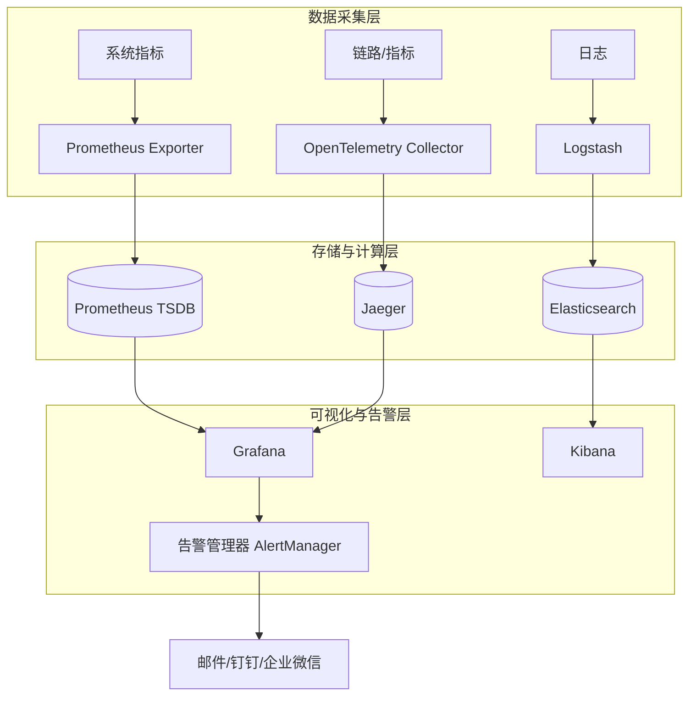

# 微服务架构

服务发现 - 注册中心、发现模式
服务通信 - 同步/异步通信
API网关 - 功能、网关选型
配置管理 - 配置中心、配置特性
负载均衡 - 类型、算法
容错与熔断 - 容错策略、熔断机制、限流
分布式事务 - 事务模式、实现方案
可观测 - 链路追踪、日志、指标
安全认证 - 认证、授权、安全网关
数据一致性 - 一致性模型、一致性保障

## 可观测

包含 指标(Metrics)、日志(Logs)和链路追踪(Traces)的立体化监控体系，即业界常说的“三大支柱”。

## OpenTelemetry

OpenTelemetry 是一个可观测性框架，旨在生成和管理遥测数据，如链路、指标和日志。  
OpenTelemetry 专注于遥测数据的生成、采集、管理和导出。遥测数据的存储和可视化是有意留给其他工具处理的。

## Metrics

指标监控维度：

- 业务指标
- 性能指标
- 资源指标
- 错误指标
- 依赖指标

## Trace

## Log
