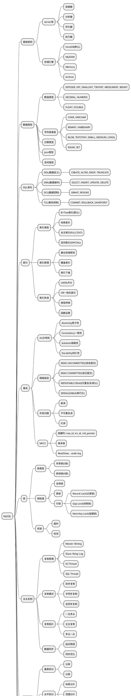

```plantuml
@startmindmap

* MySQL
** 基础架构
*** server层
**** 连接器
**** 分析器
**** 优化器
**** 执行器
*** 存储引擎
**** InnoDB(默认)
**** MyISAM
**** Memory
**** Archive

** 数据类型
*** 数值类型
**** INTEGER, INT, SMALLINT, TINYINT, MEDIUMINT, BIGINT
**** DECIMAL, NUMERIC
**** FLOAT, DOUBLE
*** 字符串类型
**** CHAR, VARCHAR
**** BINARY, VARBINARY
**** BLOB, TEXT(TINY, SMALL, MEDIUM, LONG)
**** ENUM, SET
*** 日期类型
*** json类型
*** 空间类型
** SQL语句
*** DDL(数据定义)
**** CREATE, ALTER, DROP, TRUNCATE
*** DML(数据操作)
**** SELECT, INSERT, UPDATE, DELETE
*** DCL(数据控制)
**** GRANT, REVOKE
*** TCL(事务控制)
**** COMMIT, ROLLBACK, SAVEPOINT

** 索引
*** 索引类型
**** B+Tree索引(默认)
**** 哈希索引
**** 全文索引(FULLTEXT)
**** 空间索引(SPATIAL)
*** 索引原理
**** 最左前缀原则
**** 覆盖索引
**** 索引下推
*** 索引失效
**** LIKE%开头
**** OR一侧无索引
**** 类型转换
**** 函数运算

** 事务
*** ACID特性
**** Atomicity原子性
**** Consistency一致性
**** Isolation隔离性
**** Durability持久性
*** 隔离级别
**** READ UNCOMMITTED(读未提交)
**** READ COMMITTED(读已提交)
**** REPEATABLE READ(可重复读-默认)
**** SERIALIZABLE(串行化)
*** 并发问题
**** 脏读
**** 不可重复读
**** 幻读
*** MVCC
**** 隐藏列: row_id, trx_id, roll_pointer
**** 版本链
**** ReadView、undo log

** 锁
*** 锁类型
**** 共享锁(S锁)
**** 排他锁(X锁)
*** 锁粒度
#### 全局锁
**** 表锁
**** 行锁
***** Record Lock(记录锁)
***** Gap Lock(间隙锁)
***** Next-Key Lock(临键锁)
*** 死锁
**** 超时
**** 检测

** 主从复制
*** 复制原理
**** Master: Binlog
**** Slave: Relay Log
**** IO Thread
**** SQL Thread
*** 复制模式
**** 异步复制
**** 半同步复制
**** 全同步复制
*** 复制拓扑
**** 一主多从
**** 主主复制
**** 多主一从
*** 数据同步
**** 延迟原因
**** 同步优化

** 分库分表
*** 垂直拆分
**** 分库
**** 分表
*** 水平拆分
**** 哈希分片
**** 范围分片
**** 路由规则
*** 中间件
**** ShardingSphere
**** MyCat
**** Vitess

** 集群架构
*** 主从架构
**** 读写分离
**** 故障转移
*** MGR(MySQL Group Replication)
**** Paxos协议
**** 单主/多主模式
*** InnoDB Cluster

** 备份恢复
*** 备份类型
**** 完全备份
**** 增量备份
**** 差异备份
*** 备份工具
**** mysqldump
**** xtrabackup
**** mydumper
*** 恢复方式
**** 逻辑恢复
**** 物理恢复
**** Point-in-time恢复

** 性能调优
*** 配置参数
**** innodb_buffer_pool_size
**** max_connections
**** query_cache_size
**** binlog_cache_size
*** 硬件优化
**** SSD存储
**** 内存扩容
**** CPU多核

*** SQL优化
**** 执行计划(EXPLAIN)
***** type
***** key
***** rows
***** Extra
**** 慢查询日志
***** slow_query_log
***** long_query_time
**** 分页优化
***** 延迟关联
***** 书签式分页
***** 游标分页

@endmindmap
```