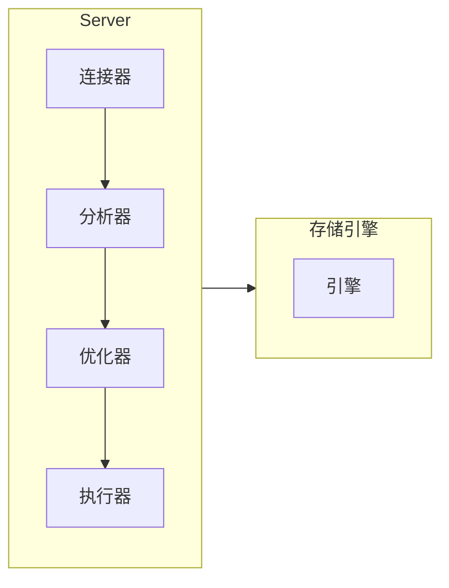

# MySQL

## MySQL 基础架构



### 连接器

连接器负责跟客户端建立连接、获取权限、维持和管理连接。

**如何连接**

连接命令：

```sh
mysql -h$ip -P$port -u$user -p
```

连接命令中的 mysql 是客户端工具，用来跟服务端建立连接。

-   如果用户名或密码不对，你就会收到一个`Access denied for user`的错误，然后客户端程序结束执行。
-   如果用户名密码认证通过，连接器会到权限表里面查出你拥有的权限。之后这个连接里面的权限判断逻辑，都将依赖于此时读到的权限。

**管理连接**

```sh
show processlist
```

结果中的 Command 列显示为“Sleep”, 代表一个空闲连接。

参数 wait_timeout 控制断连时间，默认 8 小时。断连后，如果客户端发送请求，会会收到错误提醒：`Lost connection to MySQL server during query`

随着执行，连接会持有很多对象占用大量内存造成 OOM, 可以定期断开连接，5.7 及以上版本可以`mysql_reset_connection`初始化连接资源。

### 分析器

-   词法分析，识别关键词
-   语法分析，语法校验

### 优化器

生成执行计划，选择索引，决定执行顺序等

### 执行器

调用存储引擎的接口，汇总结果集
