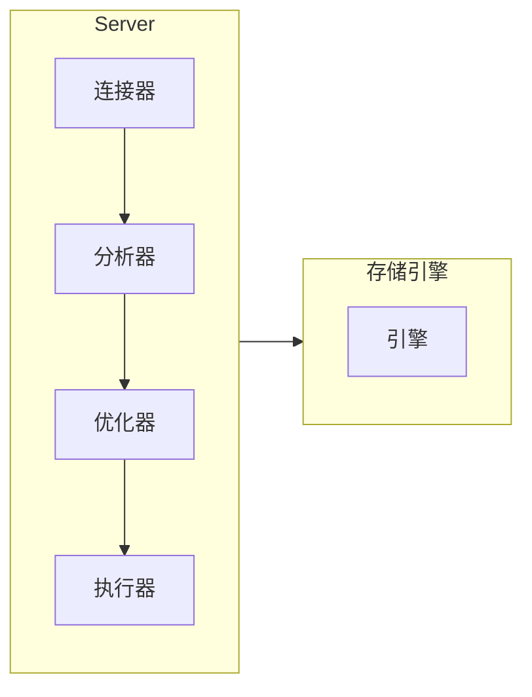

# 彻底解决 MySQL

## MySQL 基础架构

> 一条 SQL 是怎样执行的？就可以从 MySQL 架构谈起。



### 连接器

连接器负责跟客户端建立连接、获取权限、维持和管理连接。

**如何连接**

连接命令：

```sh
mysql -h$ip -P$port -u$user -p
```

命令中的 `mysql` 是客户端工具。

- 如果用户名或密码不对，你就会收到一个`Access denied for user`的错误，然后客户端程序结束执行。
- 如果用户名密码认证通过，连接器会到权限表里面查出你拥有的权限。之后这个连接里面的权限判断逻辑，都将依赖于此时读到的权限。

**管理连接**

```sh
show processlist;
```

结果中的 Command 列显示为“Sleep”, 代表一个空闲连接。

参数 wait_timeout 控制断连时间，默认 8 小时。断连后，如果客户端发送请求，会会收到错误提醒：`Lost connection to MySQL server during query`

建立的连接可以分为长连接和短连接，长连接可以避免建立连接的开销，但随着执行，连接会持有很多对象占用大量内存造成 OOM, 解决这个问题有 2 种方案，一种是可以定期断开连接；另一种是 5.7 及以上版本可以通过命令`mysql_reset_connection`初始化连接资源。

### 缓存

MySQL 8.0 就没有了。  
只要对表有修改，所有缓存都会失效。所以只有那些静态表适合用缓存，MySQL 支持显式指定哪个 sql 使用缓存。

### 分析器

分析器做词法分析和语法分析

- 词法分析，识别关键词
- 语法分析，语法校验

### 优化器

生成执行计划，选择索引，决定执行顺序 等

### 执行器

调用存储引擎的接口，汇总结果集  
慢查询日志中的 rows_examined 字段，就是执行器调用引擎获取到的累加行数。

## 写操作

要说写操作是怎样工作的，不得不提到 2 个 log，redo log 和 binlog

redo log 是 InnoDB 存储引擎的东西，它是环形的日志文件，会记录数据页的变更，也就是物理日志。  
binlog 是 Server 层实现的，是可追加的逻辑日志。

redo log 就是 WAL(Write-Ahead-Logging)里的 log。具体而言，就是先写 redo log，并更新内存，这时就算更新完成了，之后会刷写磁盘页。刷写频率由 `innodb_flush_log_at_trx_commit` 参数控制。  
写入 redo log 时有 write pos(写入位置) 和 checkpoint(清除位置)，如果 write pos 追上 checkpoint，就要刷写磁盘，向前推动 checkpoint。

sync_binlog 参数控制 binlog 持久化频率。

### 二阶段提交

redo log 有 2 种状态，写入 redo log 后，先是 prepare 状态，然后写 binlog，然后提交事务 redo log 置为 commit 状态。  
如果写完 binlog 后宕机，事务未提交，这时或检查 binlog 是否完整，如果完整就提交事务，否则回滚。

## 事务

事务是数据库系统的重头戏。

### 事务的隔离级别

老生常谈

- 读未提交（read uncommitted）：事务没提交就能被别的事务看到
- 读提交（read committed）：事务提交了就能被看到
- 可重复读（repeatable read）：事务执行过程中看到的数据，跟事务启动时看到的数据一致
- 串行化（serializable ）：事务串行

读提交和可重复读的实现差异在于视图不同，可重复读使用事务启动时创建的视图，读提交使用每条 SQL 执行时创建的视图。

### MVCC

要控制事务的隔离级别，就需要不同版本的视图，也就是 MVCC。  
视图由事务创建，同时会有 undo log，视图跟 undo log 配合实现事务的回滚。undo log 只有再不会用到的时候才删除，也就意味着最低版本的视图之前的 undo log 才会删。  
视图没有物理结构，但有 row trx_id, 是事务的版本号。根据 trx_id 和 undo log 可以计算出上一个版本。  
行记录里面没有是否提交的状态，事务之间又是隔离的，那么，一个事务如何知道一个视图是否可用？在实现上，事务开始的时候，会保存所有活跃状态事务的 id，其中最大最小值作为高低水位，低水位以下的视图可读，高水位以上视图的不可读；视图的 trx_id 在活跃事务列表中，说明未提交，不可读；如果不在活跃事务列表中，说明该 row 的该视图已提交，可读。

### 事务的启动

有 2 种，一种是显式启动，`begin` 或者 `start transaction`；另一种是 `set autocommit=0`，也就意味着自动启动事务(都会自动启动事务)，但不会自动提交。begin 的作用是让事务在`autocommit=1`下不会自动提交。

### 如何找到长事务

information_schema 库的 innodb_trx 表中查询长事务

## 锁

锁又是重头戏

### 锁的种类

根据加锁范围，大致可以分为 全局锁、表级锁和行锁 3 类。
根据读写分类，可以分为读锁和写锁。

#### 全局锁

全局锁就是对库加锁。`Flush tables with read lock`，这个命令可以让整个库变成只读状态。通常用于整库备份。  
想不阻塞写操作，可以使用 mysqldump 工具并配合参数 single-transaction，这样可以启动一个事务利用隔离级别拿到一致性视图。

#### 表级锁

表级锁有 2 种，一种是主动加的表锁，另一种是自带的 MDL(meta data lock)。

表锁的语法是 `lock tables … read/write`。在没有更细粒度的锁时，表锁是常用的处理并发的方式。

DML 的读锁之间不互斥，写锁是独占的。写锁很危险，容易阻塞。通常要先检查长事务。

MariaDB 已经支持了类似 try 的语法，`NOWAIT` 或 `WAIT N`

```sql
ALTER TABLE tbl_name NOWAIT add column ...
ALTER TABLE tbl_name WAIT N add column ...
```
