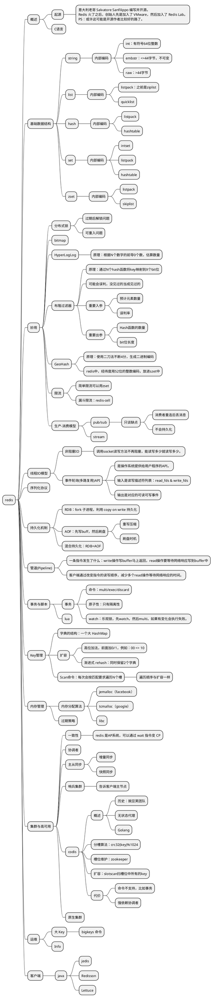

```plantuml

@startmindmap
* redis
** 概述
*** 起源
**** 意大利老哥 Salvatore Sanfilippo 编写并开源。\nRedis 火了之后，创始人先是加入了 VMware，然后加入了 Redis Lab。\nPS：或许这可能是开源作者比较好的路了。
*** C语言

** 基础数据结构
*** string
**** 内部编码
***** int：有符号64位整数
***** embstr：<=44字节，不可变
***** raw：>44字节
*** list
**** 内部编码
***** listpack：之前是ziplist
***** quicklist
*** hash
**** 内部编码
***** listpack
***** hashtable
*** set
**** 内部编码
***** intset
***** listpack
***** hashtable
*** zset
**** 内部编码
***** listpack
***** skiplist

** 妙用
*** 分布式锁
**** 过期后解锁问题
**** 可重入问题

*** bitmap

*** HyperLogLog
**** 原理：根据N个数字的前导0个数，估算数量

*** 布隆过滤器
**** 原理：通过N个hash函数将key映射到X个bit位
**** 可能会误判，没见过的当成见过的
**** 重要入参
***** 预计元素数量
***** 误判率
**** 重要出参
***** Hash函数的数量
***** bit位长度


*** GeoHash
**** 原理：使用二刀法不断4分，生成二进制编码
**** redis中，经纬度用52位的整数编码，放进szet中

*** 限流
**** 简单限流可以用zset
**** 漏斗限流：redis-cell


*** 生产-消费模型
**** pub/sub
***** 只谈缺点
****** 消费者重连后丢消息
****** 不会持久化
**** stream


** 线程IO模型
*** 非阻塞IO
**** 调用socket读写方法不再阻塞，能读写多少就读写多少。
*** 事件轮询(多路复用)API
**** 是操作系统提供给用户程序的API。
**** 输入是读写描述符列表：read_fds & write_fds
**** 输出是对应的可读可写事件

** 序列化协议

** 持久化机制
*** RDB：fork 子进程，利用 copy on write 持久化
*** AOF：先写buff，然后刷盘
**** 重写压缩
**** 刷盘时机
*** 混合持久化：RDB+AOF


** 管道(Pipeline)
*** 一条指令发生了什么：write操作写buffer马上返回，read操作要等待网络响应写到buffer中
*** 客户端通过改变指令的读写顺序，减少多个read操作等待网络响应的时间。

** 事务与脚本
*** 事务
**** 命令：multi/exec/discard
**** 原子性：只有隔离性
**** watch：乐观锁，先watch，然后multi，如果有变化会执行失败。
*** lua

** Key管理
*** 字典的结构：一个大 HashMap
*** 扩容
**** 高位加法，前面加0/1，例如：00 => 10
**** 渐进式 rehash：同时保留2个字典
*** Scan命令：每次会按匹配要求遍历N个槽
**** 遍历顺序与扩容一样


** 内存管理
*** 内存分配算法
**** jemalloc（facebook）
**** tcmalloc（google）
**** libc

*** 过期策略


** 集群与高可用
*** 一致性
**** redis 是AP系统，可以通过 wait 指令变 CP

*** 协调者

*** 主从同步
**** 增量同步
**** 快照同步

*** 哨兵集群
**** 告诉客户端主节点
*** codis
**** 概述
***** 历史：豌豆荚团队
***** 无状态代理
***** Golang
**** 分槽算法：crc32(key)%1024
**** 槽位维护：zookeeper
**** 扩容：slotscan扫槽位中所有的key
**** 代价
***** 命令不支持，比如事务
***** 强依赖协调者

*** 原生集群

** 运维
*** 大 Key
**** bigkeys 命令
*** Info

** 客户端
*** java
**** jedis
**** Redisson
**** Lettuce

@endmindmap

```